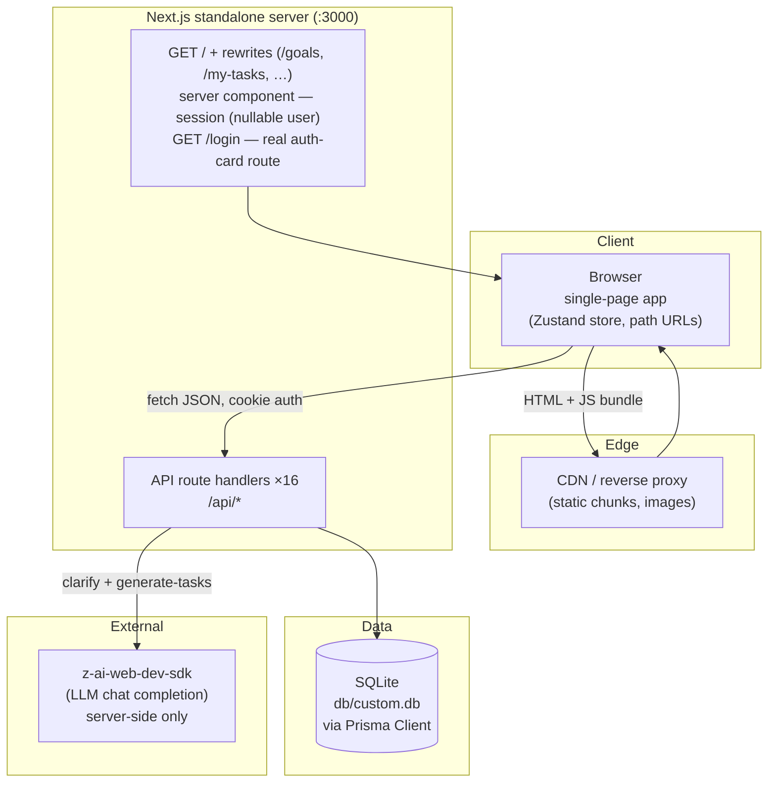

# ORBITAL — Master Project Architecture Document (PAD) v1.5

**Classification:** Internal Engineering Reference
**Status:** DEFINITIVE, PRODUCTION-LOCKED BLUEPRINT
**Companion Documents:** `README.md` (user-facing), `CLAUDE.md` (agent contract), `AGENTS.md` (operator notes)
**Last Updated:** 2026-09-17
**Audience:** Senior Engineers, Tech Leads, DevOps, and Onboarding Engineers
**Rule:** Every architectural decision in this document traces to a specific rationale. Nothing is here "because it's popular."

#### Revision Block — v1.5

- `[MOD]` **Dark primary action hierarchy measured and adopted**: every in-dialog primary submit — the check-in modal's "Post Update" (`#2F2823`, radius 14, 32px, literal Title Case + Send icon, content-sized), the wizard's "Continue" and the Add/Edit dialogs' submits (`#3A3A3A` bg, `#F1F1F0` text, radius 10) — renders a charcoal pill; dialog "Cancel" buttons are soft inset wells. Page-level actions (NEW GOAL, ADD TASK, DELETE, Team's round Invite/New Agent pills) stay neumorphic raised. New primitives: `.orb-btn-dark`, `.orb-btn-post`, `.orb-btn-cancel`, `.orb-pill-round`.
- `[MOD]` **Shell: 1200px content clamp + canvas glow**: all main content wraps in `max-w-[1200px]` (the shell owns the clamp — per-view max-widths removed), and the canvas carries a fixed decorative purple radial gradient (`radial-gradient(600px at 87.44% 95.38%, rgba(201,179,245,0.35), transparent 70%)`, pointer-events none) under the content.
- `[MOD]` **Dashboard rebuilt as a 2×2 grid**: top-left cell = date card (330×180; bright `day-hills.jpg` photo extracted from the reference, 0.8 opacity; raised date square radius 12 with `clamp(28px,3.5vw,52px)` fw-300 numerals) beside a 180×180 ring card holding a **plain CSS inset circle** (no SVG ring — `FaintRing` deleted); top-right = the three-column stats panel (526×180); bottom row = Agent Activity + Goals at equal widths. The greeting is 28px at every breakpoint.
- `[MOD]` **Check-in (task-detail) modal**: 448px / radius 16 (the measured exception to the 500px/radius-20 form-dialog base); plain radio labels (no card wrappers); bordered transparent textarea (1px `#D8D4CF`, radius 14, 80px); dark content-sized "Post Update" pill.
- `[MOD]` **Goals card polish**: status chip = inset well pill with a **light-purple pip (`#C9B3F5`) for every status**, gray `#6E6E6E` label, inline red "· N blocked" count, trailing `›`; meta stacks task fraction and date on two lines; the 6px progress track reads as pressed-in (inset shadow pair).
- `[MOD]` **Date picker**: raised `#EEEAE6` popover (260px, radius 16 — was a 292px white card); today renders as bold purple `#996CE4` text; new pure seam `formatLongDate` (TDD, 80 → 85 unit checks) produces the reference's long trigger format ("September 20th, 2026").
- `[MOD]` **View-level parity**: My Tasks ships five filter tabs (All / Pending / In Progress / Blocked / Done — no "Need Help"); empty states render directly on the canvas (no card wrapper); Settings gains the "Active Window" sub-header; the user-menu Log Out icon sized 24px; the Agent Activity live dot is a 7px `#2ECC8A` pulse (`.orb-live-dot`), not an expanding ping.

#### Revision Block — v1.4

- `[MOD]` **The visual system was re-measured and rebuilt as neumorphic** (fresh crawl of the reference, 28 captures + computed-style dumps): the outer rounded surface panel is gone — the page is a beige canvas (`#EBE7E2`, 24px padding) on which every surface is a raised `#EEEAE6` panel (radius 16–20) with dual embossed shadows, or an inset `#EBE7E2` well (inputs, chips, clock, status pills); progress tracks are `#DDD8D0`. Tokens + primitive classes live in `globals.css` (`.orb-raised`, `.orb-raised-lg`, `.orb-raised-btn`, `.orb-well`, `.orb-well-pill`, `.orb-task-blocked`). Sidebar re-measured: 240px expanded / 64px collapsed; dialogs normalized to 500px radius-20 panels.
- `[FIX]` CSS cascade trap found and fixed during verification: custom classes in `@layer utilities` are emitted AFTER Tailwind's generated utilities, so an arbitrary `shadow-[…]` utility paired with `.orb-card` silently loses — the blocked-task coral inset ring never rendered. Fixed with the dedicated `.orb-task-blocked` class (declared after `.orb-card`); the rule is documented in AGENTS.md/CLAUDE.md.
- `[MOD]` **Auth flow rebuilt to match the reference's current behavior**: unauthenticated visits render the workspace shell (nullable user) with a **LOG IN** button in the header; login is a real `/login?from_url=…` route rendering a centered white card with three states (sign-in / sign-up / forgot-password) and a "Continue with Google" option that degrades to an explanatory toast (no OAuth credentials — same doctrine as the AI fallbacks). The old full-screen dusk-hills login page is retired (the hills image now only lives on the dashboard date card).
- `[NEW]` Custom date picker (`ui/date-picker.tsx`): "Pick a deadline" well-style trigger opening a popover calendar (month chevrons, Su–Sa headers, 7×6 grid, today ringed, click-to-select-and-close) — replaces the wizard's native `<input type="date">`. Grid math lives in the pure seam `src/lib/calendar.ts` (`monthGrid`, `isSameDay`), written TDD red → green (71 → 80 unit checks).
- `[MOD]` Copy + micro-parity: task-detail modal shows only "Assigned to: …" (Goal/Deadline lines removed) with the Title Case "Post Status Update" label; My Tasks empty copy shortened; mobile stat cards carry abbreviated sub-labels ("31 tasks" / "26 done" / "84% total"); mobile goal-card meta includes the blocked count.

#### Revision Block — v1.3

- `[FIX]` Dashboard NEXT PLANNED ACTION text corruption: `String.replace` with a capture group left the person prefix in place (`Resolve blocker on "Shelly GenosarReview Q3 project milestones"`). Extracted to the pure seam `src/lib/next-action.ts` (`nextPlannedAction`) with a regression spec; fixed with `String.match` (61 → 71 unit checks total incl. logo geometry).
- `[MOD]` Brand marks re-measured by pixel-level connected-component analysis (VLM counts proved unreliable): sidebar mark = **six** dots in a hexagonal ring (12/2/4/6/8/10 o'clock); login card = **six** dots in a 1-2-3 pyramid inside a white circle. v1.2's "8-dot constellation" was a miscount. Geometry lives as pure helpers (`ringDotPositions` / `pyramidDotPositions`) with `logo-geometry.test.ts`; `public/orbital-logo.svg` + `logo.svg` regenerated.
- `[MOD]` Delete confirmations moved from centered `AlertDialog` modals to the reference app's **inline** pattern: goal cards swap icons for "Delete / Cancel", the goal-detail header swaps DELETE for "Delete goal & all tasks? · Yes, Delete | Cancel", task cards swap icons for "Delete? | Yes | No". `alert-dialog.tsx` no longer has app consumers.
- `[MOD]` Task cards: blocked titles render in the alert coral; edit/delete icon buttons sit on soft rounded squares (always visible). Dialog headers (Add/Edit Task) are plain titles — icon-circle embellishments removed. Task-detail modal assignee renders plain "Assigned to: Name".
- `[MOD]` Login screen: sentence-case labels ("Email" / "Password"), in-field envelope/padlock icons, "Sign in" Title Case submit, "OR" divider, `you@example.com` placeholder.
- `[MOD]` Mobile tab bar: HOME → `LayoutGrid` (four squares), MORE → `Menu` (three lines), matching the reference icons.

#### Revision Block — v1.2

- `[MOD]` Parity remediation against a second live-app capture (2026-09-17, 21 screenshots + VLM analysis): sidebar analog clock + desktop collapse (`sidebar-clock.tsx`, `sidebar-collapse.ts` — `useSyncExternalStore` + localStorage), 8-dot constellation logo, unified dashboard stats card + faint DONE ring, goal-card redesign (horizontal progress bar, always-visible actions), goal-detail 2-stat layout + inline ADD TASK, team dialogs rebuilt (email+role invite; agent name/description/instructions), wizard copy + bot avatars, settings 2-column layout.
- `[NEW]` ADR-009: fixed-window per-IP rate limiting on the auth endpoints (`src/lib/rate-limit.ts`, 10 attempts/15 min → `429 RATE_LIMITED` + `Retry-After`) — closes the §10 HIGH item.
- `[MOD]` `TeamMember` schema extended with `description` / `instructions` for AI agents; `/api/team` POST and the New Agent dialog share the new `src/lib/team.ts` seams.
- `[MOD]` Dependency prune (859 → 193 packages): zod, framer-motion, React Query, dnd-kit, react-hook-form, next-auth, recharts and other unused template extras removed; 35 unused vendored shadcn/ui components deleted (12 remain); dead `use-mobile` hook removed.
- `[MOD]` Auth navigation switched from `window.location` hard reloads to `router.refresh()` session re-resolution (ESLint-clean under Next 16 rules).
- `[MOD]` Verification gate now includes `bun run typecheck` (the build sets `ignoreBuildErrors`); unit layer 43 → 61 checks (rate-limit + team seams), smoke suite 27 → 30 checks (team validation + rate limit).

#### Revision Block — v1.1

- `[MOD]` Parity remediation against a fresh live-app capture (2026-09-17): path-based URLs (ADR-001 revised), three-step wizard with AI clarifying questions + `POST /api/goals/clarify`, user menu with Log Out, mobile bottom tab bar + MORE sheet, direct edit/delete row actions, copy alignment (title, dashboard subtitle, stat-card sub-labels).
- `[NEW]` ADR-008: Vitest unit layer on the pure domain seams (router, clarify, plan sanitizer, check-in mapping) — 43 checks; smoke suite extended 18 → 27.

#### Revision Block — v1.0

- `[SYN]` Initial PAD authored from the shipped v1.0 codebase, grounded in source inspection and an 18-check end-to-end smoke run against the production build.
- `[SR]` Stack versions verified against `package.json` / `bun.lock` and the live build log (Next.js 16.1.3, Prisma Client 6.19.2, React 19, Zustand 5.0.10).
- `[SR]` Line counts in §11 measured with `wc -l` on the committed tree.

---

## Table of Contents

1. [System Overview & Decisions](#1-system-overview--decisions)
2. [High-Level System Topology](#2-high-level-system-topology)
3. [Application Architecture](#3-application-architecture)
4. [Data Architecture](#4-data-architecture)
5. [Design System Reference](#5-design-system-reference)
6. [Security Architecture](#6-security-architecture)
7. [Testing Strategy](#7-testing-strategy)
8. [Build & Deployment](#8-build--deployment)
9. [Developer Handbook](#9-developer-handbook)
10. [Known Issues & Outstanding Tasks](#10-known-issues--outstanding-tasks)
11. [Key Files Reference](#11-key-files-reference)
12. [Glossary](#12-glossary)

*(Worker / background-service architecture is not applicable: the system runs no queues, cron jobs, or async workers. The AI planner executes inline within a request; see ADR-005.)*

---

## 1. System Overview & Decisions

### 1.1 Document Metadata & Purpose

ORBITAL is a self-hosted AI project management workspace — a functional clone of the reference Base44 application, rebuilt as a single deployable Next.js unit. Teams describe **goals** in natural language; a server-side AI planner drafts a **task plan** (assigned across people, spread over the timeline); execution is tracked through status **check-ins**; and every mutation is narrated in an **agent activity feed**. This PAD is the engineering source of truth for onboarding, debugging, and replication. New engineers should read §3 first; DevOps should start at §8; anyone touching authentication or the AI planner must read §6 before changing anything.

### 1.2 Technology Stack Summary

| Layer | Technology | Version | Key Rationale |
|-------|-----------|---------|---------------|
| Web framework | Next.js (App Router) | 16.1.1 (resolved 16.1.3) | One deployable unit for page shell + API routes; standalone output yields a portable production artifact |
| UI runtime | React | 19.x | Required by Next 16; the client store model fits React 19 fine-grained re-renders |
| Language | TypeScript | 5.x, `strict: true` (`noImplicitAny: false`) | End-to-end typing from Prisma models through DTOs to the client store |
| Styling | Tailwind CSS | 4.x (CSS-first tokens) | `--orb-*` design tokens declared in `globals.css` and mapped via `@theme inline`; no runtime CSS cost |
| Components | shadcn/ui on Radix | vendored, `src/components/ui/` (11 primitives) | Accessible primitives (dialog, select, radio-group, sheet, toast…) owned as source, not a versioned dependency; unused template components pruned in v1.2 |
| Client state | Zustand | 5.0.6 (resolved 5.0.10) | One store for all server state with explicit refresh composition; no cache-heuristics layer to tune |
| Unit tests | Vitest | 5.0.1 | Pins the pure domain seams (router, clarify, sanitizer, check-in mapping) without a browser or DB |
| ORM | Prisma | 6.11.1 (client resolved 6.19.2) | Typed, schema-first modeling; `db push` matches SQLite's no-migration workflow |
| Database | SQLite | file-based, `db/custom.db` | Zero-config persistence; single gitignored file; trivially reseeded to a canonical demo state |
| Auth | Node `crypto` | built-in (scrypt, HMAC-SHA256) | Stateless verifiable cookie sessions with no external auth dependency |
| AI planner | z-ai-web-dev-sdk | 0.0.18 | Server-side chat completion for task-plan generation; deterministic fallback keeps the feature alive without it |
| Icons | lucide-react | 0.525.x | Tree-shakeable; 35 component files import from it |
| Fonts | next/font | DM Sans, DM Mono | Self-hosted, zero layout shift, matches the reference typography |
| Runtime | Bun ≥ 1.1 / Node ≥ 20 | — | Bun runs TS scripts (seed) directly; the standalone server runs on either runtime |

### 1.3 Architecture Decision Records (ADRs)

**ADR-001: Single-page app with path-based URLs (rewrites + History API)**

- **Context:** The reference app is a browser SPA — sidebar/bottom-tab navigation, view switches without page reloads, deep-linkable URLs at real paths (`/goals/<id>`), working browser back/forward. A conventional multi-page Next.js app would change the UX contract and add route transitions the original does not have.
- **Decision:** One page (`src/app/page.tsx`, `force-dynamic`) resolves the session server-side, then renders the client shell. The six view paths (`/goals`, `/goals/:goalId`, `/my-tasks`, `/activity`, `/team`, `/settings`) are mapped onto `/` with `rewrites()` in `next.config.ts`; view state syncs with `location.pathname` through `src/lib/router.ts` (`parseUrl` / `toPath`) using `history.pushState`, and a `popstate` listener re-derives state on back/forward. Legacy `?view=…&goal=…` links still resolve for pre-v1.1 deep links.
- **Rationale:** Preserves the reference UX and URL contract exactly (the address bar shows the same paths as the original) while keeping a server-rendered auth gate and one client bundle. Unknown paths still 404 at the HTTP layer — the rewrites are an explicit allow-list, not a blanket proxy.
- **Consequences:** The rewrite list and `router.ts` must stay in sync (both cite each other); every navigation is a real history entry. Trade-off: the whole app ships as one client bundle — no per-view code splitting.
- **Alternatives Rejected:** Query-param URLs (`?view=goals` — v1.0 behavior; the reference app uses paths, and `replaceState` broke back/forward); Next.js pages per view (breaks SPA feel, duplicates the store's navigation); react-router inside Next (duplicates the router Next already provides).
- **History:** v1.0 shipped `?view=` query params with `replaceState`; revised in v1.1 after fresh capture of the live app confirmed path URLs.

**ADR-002: Prisma + SQLite with `db push` (no migrations)**

- **Context:** A fresh checkout must reach a running demo with no database server and no migration history to replay.
- **Decision:** Prisma ORM over a gitignored SQLite file; schema applied with `prisma db push`; canonical demo data via an idempotent TS seed (`bun run db:seed` wipes and reseeds domain tables).
- **Rationale:** Zero-config bootstrap; typed queries, cascades, and indexes from the Prisma schema; moving to Postgres later is a `datasource` block change, not a rewrite.
- **Consequences:** No production schema-history artifacts; SQLite's single-writer model caps write concurrency (acceptable for a team workspace).
- **Alternatives Rejected:** Drizzle (same benefit, fewer generated conveniences at this scale); Postgres (breaks the zero-config story); in-memory store (not production-grade).

**ADR-003: Hand-rolled cookie sessions (scrypt + HMAC-SHA256)**

- **Context:** Email/password auth is required; external auth services, JWT libraries, and NextAuth's OAuth machinery are not.
- **Decision:** `src/lib/auth.ts` (91 lines) implements scrypt password hashing (`salt:hash`, 64-byte key), stateless session tokens `userId.expiry.signature` signed with HMAC-SHA256, delivered as an httpOnly `orbital_session` cookie (7-day TTL, `SameSite=Lax`, `Secure` in production).
- **Rationale:** Auditable crypto code using Node built-ins; tokens verify without a session store; `timingSafeEqual` on both password and signature comparisons closes timing oracles.
- **Consequences:** No MFA/OAuth/social flows; rotating `AUTH_SECRET` invalidates every session (documented in README troubleshooting).
- **Alternatives Rejected:** NextAuth v4 (template-era dependency, pruned in v1.2 — heavy for email/password only); JWT libraries (unnecessary for cookie-carried claims); server-side session table (adds state for no benefit).

**ADR-004: Zustand as the single client-state container**

- **Context:** All server data (goals, tasks, team, activity, settings, stats) is shared across views and must refresh coherently after each mutation.
- **Decision:** One store (`store.ts`, 356 lines) holds every DTO collection plus `view`/`goalId`. Actions call the API through a `call()` envelope-unwrapper, then `Promise.all` the exact refresh set the mutation touches.
- **Rationale:** A single source of client truth; post-mutation consistency is explicit (each action lists which slices it refreshes); nothing to invalidate heuristically.
- **Consequences:** Slight over-fetching (collections refresh whole); every new endpoint must wire its refresh calls into the relevant actions.
- **Alternatives Rejected:** React Query (template-era dependency, pruned in v1.2 — cache semantics unnecessary at this scale); React Context (coarser re-renders, more boilerplate).

**ADR-005: AI features that degrade, never fail (clarify + task planning)**

- **Context:** The product's differentiator is a conversational planner: the agent asks clarifying questions about a goal draft, then drafts a task plan. Both LLM dependencies must not be able to take the feature down.
- **Decision:** `POST /api/goals/clarify` (wizard step 2) and `POST /api/goals/[id]/generate-tasks` call `z-ai-web-dev-sdk` server-side. Clarify sanitizes LLM questions (≤3, 200 chars each) and falls back to three deterministic template questions; generate-tasks sanitizes its JSON (≤10 tasks, 160-char titles, 1–40h clamp) and falls back to a deterministic 8-step template plan. The wizard passes the user's answers into the generation prompt. Generated tasks are round-robin assigned across people and spread between "now" and the goal's target date (or +45 days).
- **Rationale:** Degrade-not-fail keeps the core workflow usable in any environment; sanitization bounds what prompt-injected LLM output can write to the database or show to the user.
- **Consequences:** Environments without SDK access get generic (but useful) questions and plans; both fallback paths are unit-tested (`clarify.test.ts`, `domain.test.ts`); the clarify step logs a `goal_analyzed` activity entry either way.
- **Alternatives Rejected:** Hard SDK dependency (breaks self-hosting); client-side generation (exposes prompting and validation to the browser).

**ADR-006: Uniform API envelope `{ ok, data } | { ok, error }`**

- **Context:** Sixteen route handlers must return predictable, typed JSON that one client helper can unwrap.
- **Decision:** `src/lib/api.ts` exports `ok(data, status)` / `fail(code, message, status)`; every handler returns one of these. The store's `call()` unwraps success data or surfaces a destructive toast and returns `null`.
- **Rationale:** One response contract for all endpoints; errors carry a machine code plus a human message; the client never throws across render.
- **Consequences:** Handlers must be disciplined about using the helpers; the contract is enforced by convention (and the smoke suite asserts the envelope).
- **Alternatives Rejected:** HTTP-status-only error signalling (loses the code/message pair); throwing and catching centrally (Next route handlers have no error boundary to rely on).

**ADR-007: Standalone output with pinned file-tracing root**

- **Context:** Production must run from a portable artifact; Next's standalone tracing rewrites output paths when a parent workspace lockfile exists (observed: server landing at `.next/standalone/<nested-path>/server.js`).
- **Decision:** `output: "standalone"` with `outputFileTracingRoot` pinned to the project directory in `next.config.ts`; the build script copies `.next/static` and `public/` into `.next/standalone/`; `start` runs `server.js` from the repo root.
- **Rationale:** Guarantees the canonical `.next/standalone/server.js` layout regardless of where the repo is cloned; the artifact carries only traced runtime deps.
- **Consequences:** The server must start from the project root (npm scripts guarantee it; see also the SQLite path normalization in §3.3); `.env` is not auto-copied into the standalone tree.
- **Alternatives Rejected:** `next start` (requires the full framework in production); Docker-only packaging (adds operational weight this clone does not need — Dockerfile listed in §10 as an open item).

**ADR-008: Vitest unit layer on the pure domain seams**

- **Context:** v1.0's only verification was the 18-check E2E smoke suite — regressions in pure logic (status mapping, URL parsing, LLM-output bounds) could only be caught end-to-end, and the v1.1 remediation plan called for TDD.
- **Decision:** A Vitest layer (`bun run test`) covers exactly the pure modules: `src/lib/router.ts` (view ↔ path mapping, legacy links), `src/lib/clarify.ts` (question fallback + LLM bounds), `src/lib/plan-sanitizer.ts` (task-plan bounds + template), `src/lib/checkin.ts` (check-in → task-status mapping). Route handlers were refactored to import these modules instead of inlining the logic.
- **Rationale:** Tests at pre-agreed seams verify behavior through public interfaces; the modules are pure (no DB, no React, no Next runtime), so the suite runs in ~0.4s with zero infrastructure; red → green drove every v1.1 logic change.
- **Consequences:** New pure logic belongs in `src/lib/` with a spec; component/DB behavior stays covered by the smoke suite (now 30 checks). No coverage thresholds yet — the seam list is deliberately small and complete. v1.2 added `rate-limit.test.ts` and `team.test.ts` (43 → 61 checks); v1.3 added `next-action.test.ts` and `logo-geometry.test.ts` (61 → 71).
- **Alternatives Rejected:** Component testing (Testing Library) — the views are thin over the store, and the smoke suite already exercises them against the real server; Jest (slower, more config for the same result).

**ADR-009: Fixed-window per-IP rate limiting on the auth endpoints**

- **Context:** §6.4 flagged unthrottled `POST /api/auth/login` / `register` as the top brute-force surface (HIGH, open since v1.0). The fix had to work with zero infrastructure (no Redis) and stay testable.
- **Decision:** `src/lib/rate-limit.ts` implements a pure fixed-window limiter — `checkRate(buckets, key, limit, windowMs, now)` over a `Map` of counters with opportunistic eviction of expired entries. Route handlers call `authRateLimit(ip)` (10 attempts / 15 min per IP, IP from `x-forwarded-for` / `x-real-ip` with a trusted single proxy assumed); a throttled request gets `429 RATE_LIMITED` plus a `Retry-After` header, both through the standard envelope.
- **Rationale:** Pure-function core keeps the window math and eviction unit-testable without timers; the fixed window is the simplest policy that materially raises brute-force cost; the envelope keeps client behavior uniform (the store's `call()` already toasts errors).
- **Consequences:** Buckets live in process memory — per-instance only; a multi-instance deployment would need a shared store (documented in §6.4). Restarting the server clears buckets. Legitimate users who fat-finger a password 10 times in 15 minutes see a 429 with a countdown.
- **Alternatives Rejected:** Sliding window (more state for marginal gain here); middleware-based blocking (Next middleware runs on the edge runtime, and the limiter needs Node process memory); Redis-backed store (breaks the zero-config story).
- **History:** Added in v1.2; the smoke suite pins the behavior with a rapid-fire-login 429 check.

---

## 2. High-Level System Topology



- **Client layer** — a standard browser; no PWA/service worker. All interactivity is client-side after the initial server-rendered shell.
- **Edge layer** — optional; any static file server or CDN in front of the Node process. The app itself has no edge middleware.
- **Application layer** — one Node process serving the page (plus its six view-path rewrites) and 16 API routes. Stateless between requests (sessions are cookie-carried), so horizontal scaling is trivial behind a load balancer.
- **Data layer** — a single SQLite file on local disk. Write concurrency is serialized by SQLite; this is the layer to swap (Postgres) if the workspace outgrows a single team.
- **External services** — only the AI planner call, invoked inline during `generate-tasks` with a deterministic fallback; its absence never blocks a request.

---

## 3. Application Architecture

### 3.1 The Layer Model

```
Layer 0: Prisma schema (prisma/schema.prisma) — the source of truth for the domain.
         Rule: every entity starts here; regenerate the client after any change.

Layer 1: Route handlers (src/app/api/**/route.ts) — validation, persistence,
         activity logging. Rule: business logic lives here and only here;
         no handler exports anything shared with the client bundle.

Layer 2: Domain types & DTOs (src/lib/orbital.ts) — the shared vocabulary
         (GoalDTO, TaskDTO, status metadata, labels, colors).
         Rule: views never import Prisma types; DTOs are the contract.

Layer 3: Client store (src/components/orbital/store.ts) — the ONLY client
         that talks to the API. Rule: actions fetch, then refresh affected
         slices; components never fetch directly.

Layer 4: Views & dialogs (src/components/orbital/views|dialogs) — pure
         presentation over store state. Rule: read the store, call actions,
         render; no fetch, no direct DB concepts.
```

**Golden Rule:** dependencies point downward only. A change flows schema → handler → DTO → store action → view. A view never reaches past the store; a handler never imports a component.

### 3.2 Annotated Directory Structure

```
├── prisma/
│   ├── schema.prisma              ← 8 models; status vocabularies in comments
│   └── seed.ts                    ← idempotent demo workspace (wipes + reseeds)
├── public/
│   ├── orbital-logo.svg           ← brand mark (sidebar, login)
│   ├── logo.svg                   ← favicon
│   ├── day-hills.jpg              ← dashboard date-card photo (extracted from
│   │                                 the reference, v1.5)
│   ├── dusk-hills.jpg             ← legacy landscape (unused)
│   └── robots.txt
├── scripts/
│   └── smoke-test.sh              ← 27-check E2E suite; boots the prod server
├── src/
│   ├── app/
│   │   ├── page.tsx               ← the workspace page: session → OrbitalApp
│   │                            (nullable user — shell renders either way)
│   │   ├── login/page.tsx         ← real /login route: LoginCard, 3 states,
│   │                            ?from_url handling, authed → redirect /
│   │   ├── layout.tsx             ← DM Sans/Mono via next/font; global styles
│   │   ├── globals.css            ← Tailwind 4 @theme tokens + neumorphic
│   │                            primitive classes (.orb-raised/.orb-well/…)
│   │   └── api/
│   │       ├── health/route.ts            ← liveness probe (public)
│   │       ├── auth/{register,login,logout,me}/route.ts
│   │       ├── goals/route.ts             ← list / create
│   │       ├── goals/clarify/route.ts      ← wizard step: AI clarifying questions
│   │       ├── goals/[id]/route.ts        ← detail(+tasks) / patch / delete
│   │       ├── goals/[id]/generate-tasks/route.ts  ← the AI planner (ADR-005)
│   │       ├── tasks/route.ts             ← list (assignee/status/goal filters) / create
│   │       ├── tasks/[id]/route.ts        ← detail / patch / delete
│   │       ├── tasks/[id]/updates/route.ts ← post check-in; flips task status
│   │       ├── team/route.ts              ← people + members / invite
│   │       ├── activity/route.ts          ← feed, latest 50
│   │       ├── stats/route.ts             ← dashboard aggregates
│   │       └── settings/route.ts          ← workspace singleton get/patch
│   ├── components/
│   │   ├── orbital/
│   │   │   ├── orbital-app.tsx    ← app shell (nullable user); desktop sidebar +
│   │   │   │                        mobile bottom tab bar + MORE sheet
│   │   │   ├── login-screen.tsx   ← LoginCard — the /login auth card (3 states)
│   │   │   ├── store.ts           ← THE Zustand store (Layer 3); skips fetches
│   │   │   │                        while user is null
│   │   │   ├── user-menu.tsx      ← UserMenuOrLogin: avatar popover w/ Log Out,
│   │   │   │                        or LOG IN button when unauthenticated
│   │   │   ├── sidebar.tsx        ← nav: Dashboard, Goals, My Tasks | Agent
│   │   │   │                        Activity, Team, Settings; collapsible
│   │   │   ├── sidebar-clock.tsx   ← neumorphic analog clock (SVG, 15s tick)
│   │   │   ├── sidebar-collapse.ts ← collapse state: useSyncExternalStore
│   │   │   │                        + localStorage (orbital-sidebar-collapsed)
│   │   │   ├── task-card.tsx      ← status dot, AI badge, assignee, deadline,
│   │   │   │                        direct edit/delete buttons + inline
│   │   │   │                        "Delete? Yes No" confirm
│   │   │   ├── progress-ring.tsx  ← SVG completion ring (incl. faint variant)
│   │   │   ├── widgets.tsx        ← stat cards, tasks-status panel
│   │   │   ├── empty-state.tsx    ← illustrated empty screens
│   │   │   ├── logo.tsx           ← brand marks: 6-dot ring + 1-2-3 pyramid
│   │   │   │                        (pure geometry helpers, unit tested)
│   │   │   ├── views/             ← dashboard, goals, goal-detail, my-tasks,
│   │   │   │                        activity, team, settings (7 views)
│   │   │   └── dialogs/           ← new-goal (3-step wizard + DatePicker),
│   │   │                            goal-edit, add-task, task-edit, task-detail,
│   │   │                            invite-member
│   │   └── ui/                    ← shadcn/ui primitives (vendored, 12 in use)
│   │                                + the custom date-picker
│   ├── hooks/                     ← use-toast
│   └── lib/
│       ├── orbital.ts             ← domain types, DTOs, status metadata
│       ├── router.ts              ← view ↔ path mapping (ADR-001) + unit tests
│       ├── clarify.ts             ← wizard questions: bounds + fallback
│       ├── plan-sanitizer.ts      ← AI plan bounds + template fallback
│       ├── checkin.ts             ← check-in → task-status mapping
│       ├── calendar.ts            ← month-grid math for the date picker — unit
│       │                            tested (monthGrid, isSameDay)
│       ├── rate-limit.ts          ← fixed-window auth throttling (ADR-009)
│       ├── team.ts                ← invite/agent form normalization — unit tested
│       ├── next-action.ts         ← dashboard next-planned-action derivation — unit tested
│       ├── api.ts                 ← ok()/fail() envelope + requireSession()
│       ├── auth.ts                ← scrypt + HMAC sessions (ADR-003)
│       ├── db.ts                  ← Prisma singleton + URL normalization
│       └── utils.ts               ← cn() class merge
├── docs/
│   ├── screenshots/               ← app screenshots used by README
│   ├── ssh_git_wrapper_v3.py      ← operator SSH push tool
│   └── how-to-git-push-using-ssh-wrapper_SKILL.md ← its runbook
└── skills/                        ← operator skill catalog (not app code;
                                    eslint-ignored, do not import from src/)
```

### 3.3 Critical Code Patterns

**Pattern A — The response envelope and its single client-side consumer**

```typescript
// src/lib/api.ts — every handler returns one of these two shapes.
export function ok<T>(data: T, init?: number) {
  return NextResponse.json({ ok: true as const, data }, { status: init ?? 200 });
}
export function fail(code: string, message: string, status: number) {
  return NextResponse.json({ ok: false as const, error: { code, message } }, { status });
}

// src/components/orbital/store.ts — the ONLY sanctioned API client.
async function call<T>(url: string, init?: RequestInit): Promise<T | null> {
  const response = await fetch(url, { ...init, /* JSON headers when body */ });
  const payload = await response.json().catch(() => null);
  if (!response.ok || !payload?.ok) {
    toast({ title: "Something went wrong", description: /* server message */ });
    return null;                     // actions treat null as "abort silently"
  }
  return payload.data ?? null;
}
```

*Why this pattern:* one contract for 15 endpoints; failures degrade to a toast and a `null` return, so a network or validation error can never throw into React render. The smoke suite asserts the envelope on every endpoint it touches.

**Pattern B — SQLite URL normalization (the two-anchor problem)**

```typescript
// src/lib/db.ts — the Prisma CLI resolves relative file: URLs against
// prisma/schema.prisma; the runtime engine anchors them against CWD.
// Normalize to an absolute path BEFORE the first client is constructed.
function resolveDatabaseUrl(): string {
  const url = process.env.DATABASE_URL?.trim();
  if (!url) return `file:${path.resolve(process.cwd(), 'prisma', '../db/custom.db')}`;
  if (/^file:/i.test(url)) {
    const raw = url.replace(/^file:/i, '');
    if (path.isAbsolute(raw) || /^[A-Za-z]:[\\/]/.test(raw)) return `file:${raw}`;
    return `file:${path.resolve(process.cwd(), 'prisma', raw)}`; // CLI rule
  }
  return url; // non-SQLite URLs pass through untouched
}
process.env.DATABASE_URL = resolveDatabaseUrl();
```

*Why this pattern:* without it, `db:push`/`db:seed` (CLI anchor) and the standalone server (CWD anchor) can open *different* database files — the exact failure observed during delivery verification (`Error code 14: Unable to open the database file`). Centralizing the fix in the module that owns the client means no other code needs to care.

**Pattern C — Degrade-not-fail AI generation**

```typescript
// src/app/api/goals/[id]/generate-tasks/route.ts (abridged)
const generated = (await generateWithSdk(goal.title, goal.description))
  ?? templatePlan(goal.title);          // deterministic 8-step fallback
// generateWithSdk() returns null on: SDK import failure, empty completion,
// malformed JSON, or fewer than 4 sanitized tasks — never throws.
```

*Why this pattern:* the feature must work in every environment the app can be cloned into. The sanitizer also clamps titles to 160 chars, descriptions to 500, hours to 1–40, and caps the plan at 10 tasks — bounding what untrusted LLM output can persist.

**Pattern D — Mutations narrate themselves**

```typescript
// Every mutating handler ends with an activity write, e.g. tasks/[id]/updates:
await db.activityLog.create({
  data: {
    type: "status_update",
    message: `${session.name} set "${task.title}" to ${status.replace("_", " ")}`,
    detail: `...full sentence for the feed's expanded view...`,
    taskId: task.id, goalId: task.goalId,
  },
});
```

*Why this pattern:* the activity feed is a product surface (the "agent activity" panel), not a debug log. Omitting the write in a new endpoint silently degrades the UX contract — hence its status as an architectural invariant, enforced in review and visible in the smoke suite's task pipeline.

---

## 4. Data Architecture

### 4.1 Database Schema

```mermaid
erDiagram
    User ||--o| Person : "linked login identity"
    Person ||--o{ Task : assigns
    Goal ||--{ Task : contains
    Task ||--{ TaskUpdate : "check-in history"
    Task ||--o{ ActivityLog : references
    Goal ||--o{ ActivityLog : references
    TeamMember {
        string kind "human | agent"
    }
    WorkspaceSetting {
        string id "singleton row"
    }
```

| Model | Rows (seeded demo) | Purpose |
|-------|--------------------|---------|
| `User` | 1 | Login identity: email (unique), name, scrypt hash, avatar color |
| `Person` | 10 | Assignable entity; seeded demo people + 1 row linked to the login user via `userId` (drives "My Tasks") |
| `TeamMember` | 0 | Starts empty (fresh workspace, like the reference app); humans (`kind: "human"`) and AI agents (`kind: "agent"`, with `agentRole`) accrue through invites |
| `Goal` | 3 | title, description, status (2 active + 1 done), targetDate, sortOrder |
| `Task` | 31 | title, description, status (26 done, 2 blocked, 3 pending), deadline, assigneeId, estimatedHours, `createdByAi`, sortOrder |
| `TaskUpdate` | 0 | Check-ins: status + optional note, newest first. The seed sets task statuses directly rather than synthesizing history; rows accrue through real use |
| `ActivityLog` | 22 | The feed: type, message, detail, task/goal refs, createdAt |
| `WorkspaceSetting` | 1 | Fixed `singleton` id: name, workStart/workEnd, pingFrequency, aiTone |

### 4.2 Data Models — Status Vocabularies

Three distinct, non-interchangeable vocabularies (canonical metadata: `TASK_STATUS_META` / `GOAL_STATUS_META` / `UPDATE_STATUS_META` in `src/lib/orbital.ts`):

| Vocabulary | Values | Set by |
|------------|--------|--------|
| Task status | `pending` `in_progress` `blocked` `need_help` `done` | Task create/patch; also flipped by check-ins |
| Goal status | `active` `done` `draft` `paused` | Goal create/patch |
| Check-in status | `on_track` `blocked` `need_help` `done` | `POST /api/tasks/[id]/updates` |

Posting a check-in syncs the task's workflow status: `done`/`blocked`/`need_help` map identity onto the task, while `on_track` keeps the current status and only un-blocks (`blocked`/`need_help` → `in_progress`; a check-in is not work starting, so `pending` stays `pending`). Completing the **last open task** in an active goal auto-completes the goal and logs `goal_completed` — one API call can update the update history, the task, the goal, and the feed.

### 4.3 Persistence Strategy

- **Client singleton:** exactly one `PrismaClient` per process, memoized on `globalThis` in dev to survive HMR (§ Pattern B covers URL normalization).
- **Schema evolution:** `prisma db push` (no `migrations/` folder by design — ADR-002). The seed is idempotent: it wipes all domain tables then reinserts the canonical demo workspace.
- **Referential actions:** `Task.goal` → `Cascade` (deleting a goal deletes its tasks); `Task.assignee` → `SetNull` (deleting a person orphans tasks, never blocks); `TaskUpdate.task` → `Cascade`.
- **Indexes:** `Person.name`; `Goal.status`; `Task.{goalId, assigneeId, status}`; `TaskUpdate.taskId`; `ActivityLog.createdAt` — matching the list endpoints' filter and sort shapes.
- **Query logging:** Prisma logs queries in development, errors only in production (`src/lib/db.ts`).

---

## 5. Design System Reference

### 5.1 Typographic System

| Face | Weights | Usage |
|------|---------|-------|
| **DM Sans** | variable | All UI text; loaded via `next/font` (`--font-dm-sans`), mapped to Tailwind `font-sans` |
| **DM Mono** | variable | Numeric and date accents (`--font-dm-mono`, `font-mono`) |

Both are self-hosted by `next/font` at build time — no runtime Google Fonts request, no layout shift.

### 5.2 Color Tokens

Declared as CSS variables in `src/app/globals.css`, exposed to Tailwind 4 via `@theme inline` (`orb-*` utilities). v1.4 re-measured the reference and rebuilt the surface system as **neumorphic** — a soft-beige scheme where raised panels carry dual embossed shadows (light `rgba(255,250,244,…)` top-left, dark `rgba(160,143,126,…)` bottom-right) and inset wells carry the same pair inverted:

| Token | Hex | Usage |
|-------|-----|-------|
| `--orb-canvas` | `#EBE7E2` | Page canvas (24px padding, no outer panel) |
| `--orb-raised` | `#EEEAE6` | Raised surfaces: sidebar, cards, dialogs, buttons |
| `--orb-well` | `#EBE7E2` | Inset wells: inputs, chips, clock face, icon squares |
| `--orb-track` | `#DDD8D0` | Progress track behind the green fill |
| `--orb-body` | `#2F2823` | Primary text |
| `--orb-heading` | `#3A3A3A` | Headings / button text |
| `--orb-muted` | `#6E6E6E` | Secondary text |
| `--orb-green` / `-deep` | `#2ECC8A` / `#1F8F5F` | Done / active / success; deep for text on light |
| `--orb-purple` / `-deep` | `#996CE4` / `#6B4BBF` | In-progress, AI accents |
| `--orb-coral` / `-deep` | `#FF8077` / `#C9574E` | Blocked / destructive; blocked task cards add a coral inset ring (`rgba(255,128,119,0.18)`, `.orb-task-blocked`) |
| `--orb-amber` | `#F5B841` | Pending status dot |
| `--orb-pink` | `#FFCBDE` | Need-help status dot |
| `--orb-sand` | `#C4996A` | Paused goal |

Status → color binding is centralized in `TASK_STATUS_META` (dot + text colors per status), so a status never renders with an ad-hoc color. The legacy `tailwind.config.ts` carries only shadcn/ui HSL tokens and `tailwindcss-animate`.

**Primitive classes** (same file, `@layer utilities`): `.orb-raised` (radius 16), `.orb-raised-lg` (radius 20 — sidebar, dialogs, stat blocks), `.orb-raised-btn` (radius 12 buttons), `.orb-well` (radius 10 insets), `.orb-well-pill` (full-radius chips), `.orb-card` (alias of raised), `.orb-task-blocked` (blocked-card coral ring), plus the `.orb-pill` action family. **Cascade rule:** these custom classes are emitted after Tailwind's generated utilities — never pair an arbitrary `shadow-[…]` utility with `.orb-card`/`.orb-raised` on one element (the utility loses); use a dedicated custom class for shadow overrides.

### 5.3 Component Primitives

shadcn/ui (Radix-based), vendored under `src/components/ui/` (12 in use): `button`, `dialog` (all modals — 500px radius-20 neumorphic panels — including the conversational New Goal wizard), `input` (well-styled), `label`, `popover` (user menu + date picker), `radio-group` (check-in radios), `select` (assignee/status pickers), `sheet` (mobile MORE sheet), `textarea` (well-styled), and `toast` (via `use-toast` + `toaster`), plus the bespoke `date-picker` (popover calendar on the `calendar.ts` seam). Bespoke ORBITAL components (`task-card`, `progress-ring`, `widgets`, `empty-state`, `logo`) are built on these primitives, not around them. Deletes confirm inline in the cards themselves (v1.3), so no alert-dialog primitive is needed.

### 5.4 Motion / Animation

Deliberately restrained, all CSS-based: the mobile bottom tab bar, the MORE bottom sheet (slide-in from Radix primitives), dialog enter/exit, toast slide-ins, and hover transitions on cards/buttons. `framer-motion` was pruned with the other unused template extras in v1.2. A `prefers-reduced-motion: reduce` media query in `globals.css` disables animations and transitions for users who opt out.

---

## 6. Security Architecture

### 6.1 Security Rules

| # | Rule | Enforcement |
|---|------|-------------|
| 1 | Every API route (except `/api/health` and `/api/auth/*`) requires a valid session | `requireSession()` first line of each handler; 401 envelope otherwise |
| 2 | Passwords are never stored or logged in plaintext | scrypt with per-user 16-byte salt, 64-byte key (`src/lib/auth.ts`) |
| 3 | Session tokens cannot be forged or altered | HMAC-SHA256 over `userId.expiry` with `AUTH_SECRET`; verified with `timingSafeEqual` |
| 4 | Cookies are invisible to scripts and scoped | `httpOnly`, `SameSite=Lax`, `Secure` in production, `path=/`, 7-day TTL |
| 5 | All input is validated server-side | Manual guards in every handler: trim, length caps, enum membership, referential existence |
| 6 | SQL injection is structurally impossible | All queries through Prisma's parameterized client |
| 7 | No secrets in the repository | `.gitignore` rejects `.env`, `*.key`, `ssh-key.txt`; keys supplied out-of-band per the SSH-wrapper runbook |
| 8 | LLM output is treated as untrusted | `sanitizeTasks()` clamps count/lengths/hours in `generate-tasks` |
| 9 | Auth endpoints are throttled per IP | Fixed-window limiter (ADR-009): 10 attempts/15 min → `429 RATE_LIMITED` + `Retry-After`; in-memory, single-node |

### 6.2 Security Utilities

| Utility | Location | Responsibility |
|---------|----------|----------------|
| `hashPassword` / `verifyPassword` | `src/lib/auth.ts` | scrypt hash + timing-safe verification |
| `createSessionToken` / `parseSessionToken` | `src/lib/auth.ts` | HMAC sign/verify of stateless tokens |
| `setSessionCookie` / `clearSessionCookie` | `src/lib/auth.ts` | Cookie lifecycle with hardening flags |
| `requireSession` | `src/lib/api.ts` | Route-handler guard returning the session user |
| `sanitizeTasks` | `generate-tasks/route.ts` | Bounds LLM-generated data before persistence |
| `checkRate` / `authRateLimit` / `clientIpOf` | `src/lib/rate-limit.ts` | Fixed-window per-IP throttling for the auth routes (ADR-009) |
| `resolveDatabaseUrl` | `src/lib/db.ts` | Path normalization (prevents accidental cross-location DB access) |

### 6.3 Authentication & Authorization

Single-workspace model with no RBAC: any authenticated user has full read/write access to all goals, tasks, team, and settings. Registration (`/api/auth/register`) is open; email is unique, password minimum length enforced (8). "My Tasks" resolves through the `Person` row linked to the login user (`Person.userId`), not through a role. Adding RBAC would mean a role column on `User` plus a check in `requireSession` — deliberately out of scope for v1.0 (see §10).

v1.4 auth surface (mirrors the reference): unauthenticated visits render the workspace shell with a LOG IN header button (the store skips data fetches while `user` is null — reads/mutations stay session-gated, so nothing leaks); `/login` is a real route serving the `LoginCard` (sign-in / sign-up / forgot states, `?from_url=` return handling, authenticated visits redirect to `/`). "Continue with Google" is rendered for visual parity but carries no credentials — it degrades to an explanatory toast, the same degrade-not-fail doctrine as the AI features. The reference's public-read API behavior is a Base44 platform artifact and a documented deviation.

### 6.4 Threat Model

| Vector | Mitigation | Residual risk |
|--------|------------|---------------|
| Session forgery | HMAC-SHA256 + timing-safe compare; 64-hex signatures | Weak `AUTH_SECRET` in prod if operator ignores the README warning |
| Password brute force | scrypt (memory-hard) per attempt + per-IP rate limit (ADR-009) | Buckets are per-process — a multi-instance deploy needs a shared store |
| CSRF | `SameSite=Lax` + JSON-only bodies (no form-encoded mutations) | Lax allows top-level GET navigations only; all mutations are POST/PATCH/DELETE with JSON |
| XSS | React auto-escaping; no `dangerouslySetInnerHTML` anywhere in `src/` | None known |
| SQLi | Prisma parameterization throughout | None known |
| Prompt-injected LLM output | Sanitizer clamps (≤10 tasks, 160-char titles, 1–40 h) | Malicious-but-well-formed content can still appear as task text (user-deletable) |
| Open registration | By design (demo parity) | Any visitor can create an account — §10 lists gating options |

---

## 7. Testing Strategy

### 7.1 Test Distribution

| Category | Files | Checks | Location | Framework |
|----------|-------|--------|----------|-----------|
| End-to-end API smoke | 1 (`scripts/smoke-test.sh`) | 30 | `scripts/` | Bash + curl + python3 (no test framework needed) |
| Unit (pure domain seams) | 8 (`src/lib/*.test.ts`) | 85 | `src/lib/` | Vitest 5 (`bun run test`) |

### 7.2 Test Patterns

The unit layer (`bun run test`, ~1.1s, zero infrastructure) pins the pure seams: `router.test.ts` (view ↔ path mapping incl. legacy `?view=` links and unknown-path fallback), `clarify.test.ts` (deterministic questions + LLM-output bounds), `domain.test.ts` (plan sanitizer clamps, template fallback, check-in → task-status mapping incl. the on_track unblock rule), `rate-limit.test.ts` (fixed-window accounting, expired-bucket eviction, limit boundary, retry-after math), `team.test.ts` (email → display-name derivation, agent-field normalization bounds), `next-action.test.ts` (next-planned-action extraction incl. the v1.3 name-prefix regression), `logo-geometry.test.ts` (six-dot ring angles, 1-2-3 pyramid rows), `calendar.test.ts` (month-grid boundaries, leap February, the 6-row invariant, `isSameDay`, and — added v1.5 — `formatLongDate` ordinals: 1st/2nd/3rd, 11th–13th, 21st/22nd/23rd, all twelve months). All v1.1–v1.5 logic changes were written red → green at these seams.

The smoke suite boots the **production standalone server** (not dev mode), polls `/api/health` until ready, then exercises: login (valid / wrong password / unauthenticated), all six read endpoints (envelope asserted), task creation, invalid-status rejection (400), the full check-in round-trip (task status flips + update recorded), deletion, logout invalidation, page render, **path-route serving** (`/goals`, `/goals/<id>`, `/my-tasks`, `/activity`, `/team`, `/settings` each return the app shell; an unknown path must 404), the **clarify endpoint** (three questions returned; title-less payload rejected 400), **team validation** (invite with an invalid email rejected 400; agent without a name rejected 400), and the **login rate limit** (rapid-fire attempts earn `429 RATE_LIMITED`). Each step prints `PASS:`/`FAIL:`; the script exits non-zero on any failure and kills the server on exit. Artifacts land in `/tmp/smoke-*` for post-mortem.

### 7.3 Coverage Thresholds

- **Gate (mandatory before push):** `bun run lint` → `bun run typecheck` → `bun run test` (**85/85**) → `bun run build` → `./scripts/smoke-test.sh` with **30/30 PASS**. There is no hosted CI; this local gate is the only gate. The `typecheck` step is not optional: `next.config.ts` sets `ignoreBuildErrors`, so the build alone will not surface type errors.
- Line/branch coverage is not measured — the seam list is small and deliberately complete (see ADR-008).

### 7.4 Pre-Push Checklist

- [ ] `bun run lint` exits 0
- [ ] `bun run typecheck` exits 0
- [ ] `bun run build` compiles clean
- [ ] `bun run test` → 85/85 PASS
- [ ] `./scripts/smoke-test.sh` → 30/30 PASS
- [ ] New/changed endpoints write their `ActivityLog` entries (Pattern D)
- [ ] Schema changes regenerated (`bunx prisma generate`) and reseeded (`db:push` + `db:seed`)
- [ ] No `.env`, keys, or `db/*.db` staged (`git status` review)
- [ ] Commit message follows `:art: feat:` / `:memo: docs:` / `:bug: fix:` convention on `main`

---

## 8. Build & Deployment

### 8.1 Production Build

```bash
bun run build
# = next build
#   && cp -r .next/static .next/standalone/.next/
#   && cp -r public .next/standalone/
bun run start    # NODE_ENV=production bun .next/standalone/server.js  (port 3000)
```

The standalone tree contains the traced `node_modules`, the static chunks, and `public/` — a self-sufficient artifact. `outputFileTracingRoot` (ADR-007) pins the layout; the server **must** start from the repo root so the SQLite path normalization (Pattern B) resolves.

### 8.2 Environment Variables

| Name | Required | Description | Default |
|------|----------|-------------|---------|
| `DATABASE_URL` | Yes | SQLite file. Relative `file:` paths resolve against `prisma/` (CLI rule), normalized to absolute at runtime by `src/lib/db.ts`. | `file:../db/custom.db` |
| `AUTH_SECRET` | Production | HMAC secret for session tokens (`openssl rand -hex 32`). Unset ⇒ insecure dev-only constant is used (by design, loudly documented). | — |

### 8.3 Docker Configuration

None — no `Dockerfile` or compose file ships with v1.0. The standalone artifact is Docker-ready (single Node entrypoint, no build tools needed at runtime); containerization is tracked in §10.

### 8.4 CI/CD Pipeline

No hosted CI (no `.github/workflows`). The pipeline is the local gate (§7.3) followed by an authenticated push: `python3 docs/ssh_git_wrapper_v3.py --key-file <key outside the repo> --remote git@github.com:nordeim/project-management.git`. The wrapper materializes the key into a 0600 temp file, preflights auth with `ls-remote`, pushes `HEAD:refs/heads/main`, verifies the remote ref equals local HEAD, syncs the origin tracking ref, then shreds the key. Full runbook: `docs/how-to-git-push-using-ssh-wrapper_SKILL.md`.

---

## 9. Developer Handbook

### 9.1 Local Setup

```bash
git clone https://github.com/nordeim/project-management.git && cd project-management
bun install                # or: npm install
cp .env.example .env       # defaults are correct for local use
bun run db:push            # create db/custom.db from the schema
bun run db:seed            # canonical demo workspace
bun run dev                # http://localhost:3000
```

Demo login: `demo@orbital.app` / `Demo1234!`. Full verification: `bun run build && ./scripts/smoke-test.sh` (expects 30/30 PASS; unit layer via `bun run test`, 85/85).

### 9.2 Common Commands

| Command | Purpose |
|---------|---------|
| `bun run dev` | Dev server on :3000, logs to `dev.log` |
| `bun run build` | Production build + standalone assembly |
| `bun run start` | Serve the standalone build (from repo root only) |
| `bun run lint` | ESLint (flat config; `skills/`, `docs/` build dirs ignored) |
| `bun run typecheck` | `tsc --noEmit` — the type gate (build sets `ignoreBuildErrors`) |
| `bunx prisma generate` | Regenerate the client after schema edits |
| `bun run db:push` | Apply schema changes to SQLite |
| `bun run db:seed` | Idempotent reset to demo data |
| `bunx prisma studio` | Inspect data in a browser (optional convenience) |
| `bun run test` | Vitest unit suite (85 checks, pure seams) |
| `./scripts/smoke-test.sh` | 30-check E2E suite against the production build |

### 9.3 Code Style Rules

- TypeScript strict (with the deliberate `noImplicitAny: false`); ESLint flat config extends `eslint-config-next` core-web-vitals + TS presets.
- Enforcement: the §7.3 gate — nothing merges or pushes without lint+build+smoke green.
- Conventions that matter in review: the layer model (§3.1), the envelope (Pattern A), the activity invariant (Pattern D), centralized status metadata (`src/lib/orbital.ts`).

### 9.4 Git Workflow

- **`main` only** — no feature branches (operator contract).
- **Commits:** Conventional Commits with emoji prefixes: `:art: feat: …`, `:memo: docs: …`, `:bug: fix: …`. Identity: `Pete A <pete@pop-os>`.
- **Push:** via `docs/ssh_git_wrapper_v3.py` with an externally supplied key (§8.4) — never a resident `~/.ssh` dependency.
- **Never committed:** `.env`, `*.key`, `db/*.db`, `node_modules/`, `dev.log`/`server.log` (all gitignored).

---

## 10. Known Issues & Outstanding Tasks

| Priority | Issue | Impact | Status |
|----------|-------|--------|--------|
| ~~HIGH~~ | ~~No rate limiting on `/api/auth/login` / `/api/auth/register`~~ | ~~Online brute-force surface~~ | **Closed in v1.2** — ADR-009 fixed-window limiter (in-memory, single-node; swap for a shared store if scaling out) |
| MEDIUM | Open registration (any visitor can create an account) | Workspace open to the public internet once deployed | Open — gate behind invite codes or an `ALLOW_REGISTRATION` env flag |
| LOW | Unit layer covers pure seams only (no component tests) | View-layer regressions surface via the smoke suite, not a fast unit run | Partially closed in v1.1 (ADR-008); component tests remain open |
| ~~LOW~~ | ~~Template dependencies unused in `package.json`~~ | ~~Larger install footprint; misleading stack claims~~ | **Closed in v1.2** — pruned 859 → 193 packages; 35 unused vendored ui components and the dead `use-mobile` hook deleted |
| LOW | `tsconfig.json` sets `noImplicitAny: false` | Weaker inference checks than full strict | Accepted (template default); tighten when convenient |
| ~~LOW~~ | ~~No `prefers-reduced-motion` handling~~ | ~~Accessibility gap in animations~~ | **Closed** — `globals.css` ships the media query (animations/transitions disabled) |
| LOW | No Dockerfile / hosted CI | Deployment and gate rely on the operator machine | Open — standalone artifact is Docker-ready; a lint+typecheck+build+smoke workflow mirrors §7.3 |
| INFO | AI generation falls back to the 8-step template when the SDK is unavailable | Generic (but usable) plans offline | By design (ADR-005) |
| INFO | "Continue with Google" renders but degrades to a toast | No OAuth credentials in a self-hosted clone | By design (v1.4 parity decision); wire a real provider if needed |
| INFO | `AUTH_SECRET` dev fallback constant | Insecure sessions if deployed without setting it | By design; README + §8.2 warn loudly |

---

## 11. Key Files Reference

| File | Lines | Purpose |
|------|-------|---------|
| `src/components/orbital/store.ts` | 374 | The Zustand store: all server state, `call()` envelope client, every action + refresh set; skips fetches while `user` is null |
| `prisma/seed.ts` | 265 | Idempotent demo workspace: user, 10 people, 3 goals, 31 tasks, 22 activity rows |
| `src/app/globals.css` | 465 | Tailwind 4 `@theme` tokens, neumorphic primitive classes, base styles, reduced-motion query |
| `src/components/orbital/views/dashboard-view.tsx` | 286 | Dashboard: greeting card, unified stats, faint done ring, activity preview, mobile abbreviated labels |
| `src/components/orbital/login-screen.tsx` | 277 | LoginCard — the `/login` auth card: sign-in / sign-up / forgot states, Google degrade |
| `src/components/orbital/orbital-app.tsx` | 221 | App shell (nullable user): collapsible desktop sidebar, mobile tab bar + MORE sheet, popstate wiring |
| `src/components/orbital/views/goals-view.tsx` | 238 | Goals grid: neumorphic cards, filter chips, inline delete confirm |
| `src/components/orbital/views/goal-detail-view.tsx` | 199 | Goal detail: 2-stat row, inline ADD TASK, header inline delete confirm |
| `src/components/orbital/views/settings-view.tsx` | 207 | Settings: 2-column layout (Workspace + Hours / AI Assistant), well inputs |
| `src/components/orbital/dialogs/new-goal-dialog.tsx` | 260 | 3-step AI wizard: describe (+ DatePicker) → clarifying questions → generate |
| `src/app/login/page.tsx` | 26 | Real `/login` route: auth-card shell, `?from_url` handling, authed redirect |
| `src/components/ui/date-picker.tsx` | 139 | Custom date picker: well trigger + popover calendar on the `calendar.ts` seam |
| `src/lib/calendar.test.ts` | 121 | Month-grid specs: boundaries, leap February, 6-row invariant, `isSameDay` |
| `src/lib/calendar.ts` | 70 | Pure month-grid math (`monthGrid`, `isSameDay`) — unit tested |
| `src/components/orbital/sidebar.tsx` | 181 | Collapsible nav: sections, clock + tasks-status row, chevron toggle |
| `src/lib/router.ts` | 91 | View ↔ path mapping (`parseUrl` / `toPath`), legacy link support — unit tested |
| `src/lib/orbital.ts` | 154 | Domain types, DTOs, status metadata (labels + colors), overdue helper |
| `src/app/api/goals/[id]/generate-tasks/route.ts` | 130 | AI planner: SDK call (with clarifying answers), sanitizer, template fallback, assignment + scheduling |
| `src/app/api/goals/clarify/route.ts` | 81 | Wizard step: AI clarifying questions + fallback + `goal_analyzed` activity |
| `src/lib/rate-limit.ts` | 59 | Fixed-window per-IP auth throttling (ADR-009) — unit tested |
| `scripts/smoke-test.sh` | 166 | 30-check E2E suite against the production server |
| `prisma/schema.prisma` | 123 | 8 models (TeamMember incl. agent description/instructions), relations, indexes |
| `src/components/orbital/sidebar-clock.tsx` | 70 | Neumorphic analog clock (SVG, 15s tick) |
| `src/lib/auth.ts` | 91 | scrypt hashing, HMAC session tokens, cookie lifecycle |
| `src/lib/plan-sanitizer.ts` | 54 | AI task-plan bounds + deterministic template — unit tested |
| `src/components/orbital/user-menu.tsx` | 68 | UserMenuOrLogin: neumorphic trigger + Log Out popover, or LOG IN button |
| `src/components/orbital/task-card.tsx` | 163 | Task row: status, AI badge, coral blocked title + `.orb-task-blocked` ring, inline "Delete? Yes No" confirm |
| `src/components/orbital/dialogs/invite-member-dialog.tsx` | 207 | Invite Member (email + role) / Create AI Agent (name/description/instructions) |
| `src/components/orbital/sidebar-collapse.ts` | 37 | Collapse state: `useSyncExternalStore` + localStorage |
| `src/lib/db.ts` | 51 | Prisma singleton + SQLite URL normalization (Pattern B) |
| `src/lib/team.ts` | 35 | Invite/agent form normalization — unit tested |
| `src/lib/clarify.ts` | 36 | Wizard question fallback + LLM bounds — unit tested |
| `src/components/orbital/logo.tsx` | 78 | Brand marks: 6-dot ring + 1-2-3 pyramid — geometry unit tested |
| `src/lib/next-action.ts` | 20 | Dashboard next-planned-action derivation — unit tested |
| `src/lib/api.ts` | 30 | `ok()` / `fail()` envelope + `requireSession()` guard |
| `src/lib/checkin.ts` | 24 | Check-in → task-status mapping — unit tested |
| `src/app/page.tsx` | 17 | The workspace page: session (nullable user) → OrbitalApp |

---

## 12. Glossary

| Term | Definition |
|------|------------|
| **Goal** | A dated outcome a team commits to; container and scheduler for its task plan |
| **Task** | A unit of work inside a goal, with status, deadline, assignee, estimated hours, and an AI-attribution flag (`createdByAi`) |
| **Check-in (TaskUpdate)** | A status report posted on a task (`on_track` / `blocked` / `need_help` / `done`, optional note); also flips the task's live status |
| **Person** | An assignable entity — seeded demo people plus one linked to each login user (`userId`), which powers "My Tasks" |
| **TeamMember** | An invited human or a configured AI agent (`kind`, `agentRole`, optional `description`/`instructions`) shown on the Team page |
| **ActivityLog** | The append-only feed narrating every mutation (create/assign/status/invite/settings) |
| **Envelope** | The uniform API response `{ ok, data }` or `{ ok, error: { code, message } }` |
| **The planner** | `POST /api/goals/[id]/generate-tasks` — LLM-backed task-plan generation (clarifying answers in, sanitized tasks out) with deterministic fallback |
| **Deep link** | A shareable view URL (`/goals/<id>`, `/my-tasks`, …) — rewrites serve the shell, `router.ts` restores the view (legacy `?view=` links still resolve) |
| **Smoke suite** | `scripts/smoke-test.sh` — the 30-check production-server verification gate |
| **Inline confirm** | The reference app's delete pattern: the action icons swap in place for a confirm pair ("Delete / Cancel", "Yes, Delete / Cancel", "Delete? Yes / No") instead of opening a modal |
| **Neumorphic** | The reference's visual system: soft-beige surfaces on a same-tone canvas, with dual embossed shadows (raised) or their inversion (inset) creating depth without borders |
| **Well** | An inset neumorphic surface (`.orb-well`) — inputs, chips, the clock face, icon squares; carries inverted shadows so it reads as pressed into the panel |
| **Raised** | A neumorphic panel (`.orb-raised` / `.orb-raised-lg`) — sidebar, cards, dialogs, buttons; carries the light top-left / dark bottom-right shadow pair |
| **SSH wrapper** | `docs/ssh_git_wrapper_v3.py` — key-materializing authenticated push tool with post-push remote verification |

