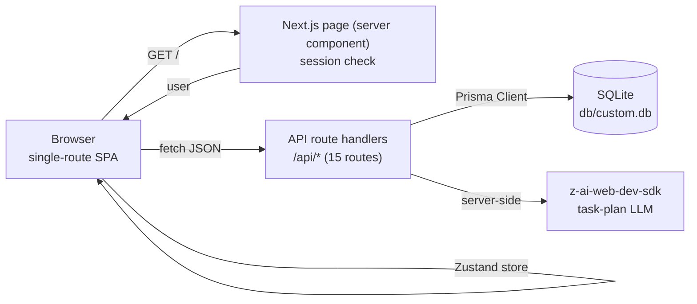

# ORBITAL — AI Project Management Workspace


A production-grade project management workspace where humans and AI agents plan goals together — a faithful, self-hosted clone of the reference app, rebuilt as a single Next.js application with cookie-session auth, an AI task planner, and a full activity feed.

## Overview

ORBITAL lets a team describe **goals** in natural language, then generates a concrete **task plan** for each goal — assigned across the team, spread over the timeline, and tracked through status check-ins. Every action lands in an **agent activity feed**, so the workspace itself narrates what the plan is doing. The app is a single-route SPA (like the original): one page, client-side view switching, deep-linkable URLs, with all persistence behind typed JSON API routes and a Prisma/SQLite store.

## Key Features

| Feature | Description |
|---------|-------------|
| 🎯 **Goals with AI task planning** | Create a goal, then generate a 6–9 task plan server-side (LLM via `z-ai-web-dev-sdk`, deterministic template fallback — never hard-fails) |
| ✅ **Task lifecycle** | Five task statuses (pending / in progress / blocked / need help / done), deadlines, assignees, estimated hours, AI-attribution badge |
| 💬 **Status check-ins** | Post on-track / blocked / need-help / done updates with notes; updates history on every task |
| 📊 **Dashboard** | Greeting + date card, progress ring, stat cards (total / done / blocked / overdue), tasks-status panel, recent agent activity |
| 👥 **Team of humans + AI agents** | Invite members or configure AI agents with roles; person directory drives assignment |
| 📜 **Agent activity feed** | Every mutation logs a typed, human-readable activity entry with full log view |
| 🔐 **Cookie-session auth** | scrypt password hashing + HMAC-signed sessions, zero external auth dependencies |
| 📱 **Responsive SPA** | Desktop sidebar and mobile slide-over menu; deep-linkable `?view=…&goal=…` URLs |
| 🌱 **One-command demo data** | Idempotent seed mirrors the reference workspace (3 goals, 31 tasks, 22 activity entries) |

## Screenshots

| Dashboard | Goals |
|:---:|:---:|
|  |  |

| Goal detail (AI-generated plan) | Task check-in |
|:---:|:---:|
|  |  |

| My Tasks | Agent activity |
|:---:|:---:|
|  |  |

| Team | Settings |
|:---:|:---:|
|  |  |

<details>
<summary>Mobile</summary>

| Dashboard | Goals | Menu |
|:---:|:---:|:---:|
|  |  |  |

</details>

## Tech Stack

| Layer | Technology | Version | Purpose |
|-------|-----------|---------|---------|
| Web framework | Next.js (App Router) | 16.1 | Server page shell + 15 API route handlers |
| UI runtime | React | 19 | Component model |
| Language | TypeScript | 5 (strict) | Type safety end-to-end |
| Styling | Tailwind CSS | 4 | Utility styling + design tokens |
| Components | shadcn/ui on Radix | — | Accessible primitives (dialog, select, radio, …) |
| State | Zustand | 5 | Single client store; server state via fetch + refresh |
| ORM | Prisma | 6 | Schema, client, `db push`, seed |
| Database | SQLite | — | Zero-config local persistence (`db/custom.db`) |
| Auth | Node `crypto` (scrypt + HMAC) | — | Cookie sessions, no external auth service |
| AI | z-ai-web-dev-sdk | 0.0.x | Server-side task-plan generation |
| Icons | lucide-react | 0.5.x | Icon set |
| Runtime | Bun (or Node ≥ 20) | — | Dev server, scripts, TS execution |

## Architecture



The page at `/` resolves the session once and hands off to the client app. All data flows through the Zustand store, which calls the API routes and unwraps the `{ ok, data } | { ok, error }` envelope. View state lives in the URL (`?view=goals&goal=<id>`), so every screen is deep-linkable — the same SPA architecture as the reference app.

## File Hierarchy

```
📂 prisma/
  📄 schema.prisma          # 8 models: User, Person, TeamMember, Goal, Task, TaskUpdate, ActivityLog, WorkspaceSetting
  📄 seed.ts                # Idempotent demo workspace seed
📂 public/
  📄 orbital-logo.svg       # Brand mark
  📄 dusk-hills.jpg         # Login/dashboard backdrop (OSS)
📂 scripts/
  📄 smoke-test.sh          # 18-check end-to-end API smoke suite (boots prod server)
📂 src/
  📂 app/
    📄 page.tsx             # Single route: session check → OrbitalApp | LoginScreen
    📄 layout.tsx           # DM Sans / DM Mono fonts, global styles
    📄 globals.css          # Tailwind 4 tokens + ORBITAL color palette
    📂 api/                 # 15 route handlers (auth, goals, tasks, team, activity, stats, settings, health)
  📂 components/
    📂 orbital/             # The application
      📄 orbital-app.tsx    # Authenticated shell: sidebar + view switcher
      📄 login-screen.tsx   # Sign-in / sign-up
      📄 store.ts           # Zustand store: all server state + actions
      📄 sidebar.tsx        # Navigation
      📂 views/             # dashboard, goals, goal-detail, my-tasks, activity, team, settings
      📂 dialogs/           # new-goal, goal-edit, add-task, task-edit, task-detail, invite-member
    📂 ui/                  # shadcn/ui component library
  📂 lib/
    📄 orbital.ts           # Domain types, DTOs, status metadata (labels + colors)
    📄 api.ts               # ok()/fail() envelope helpers + session guard
    📄 auth.ts              # scrypt hashing, HMAC session tokens, cookie handling
    📄 db.ts                # Prisma client + SQLite URL normalization
    📄 utils.ts             # cn() class merge
📄 docs/
  📂 screenshots/           # App screenshots used by this README
```

## Quick Start

Requires **Bun** (recommended) or **Node.js ≥ 20** with npm.

```bash
# 1. Install dependencies
bun install                # or: npm install

# 2. Configure environment
cp .env.example .env       # defaults are correct for local use

# 3. Create + seed the database
bun run db:push            # or: npx prisma db push
bun run db:seed            # or: npx tsx prisma/seed.ts

# 4. Start the dev server
bun run dev                # or: npm run dev
```

Open <http://localhost:3000> and sign in with the seeded demo account:

| Email | Password |
|-------|----------|
| `demo@orbital.app` | `Demo1234!` |

### Verify Setup

```bash
curl http://localhost:3000/api/health
# {"status":"ok","app":"orbital","ts":"…"}

# Full end-to-end verification (18 checks: auth, CRUD, validation, logout)
./scripts/smoke-test.sh    # builds must exist: run `bun run build` first
```

### Production

```bash
bun run build              # next build + standalone assembly
bun run start              # serves .next/standalone/server.js on :3000
```

## Environment Variables

| Variable | Required | Description | Default |
|----------|----------|-------------|---------|
| `DATABASE_URL` | Yes | SQLite connection string. Relative `file:` paths resolve against `prisma/` (CLI) and are normalized to absolute by `src/lib/db.ts` (runtime). | `file:../db/custom.db` |
| `AUTH_SECRET` | Production | HMAC secret for session cookies. Generate with `openssl rand -hex 32`. Falls back to an insecure dev constant when unset. | — |

## API Reference

All endpoints return `{ "ok": true, "data": … }` or `{ "ok": false, "error": { "code", "message" } }`. 🔒 = requires session cookie.

| Endpoint | Method | Description |
|----------|--------|-------------|
| `/api/health` | GET | Liveness probe |
| `/api/auth/register` | POST | Create account (name, email, password) |
| `/api/auth/login` | POST | Sign in, sets session cookie |
| `/api/auth/logout` | POST | Clear session |
| `/api/auth/me` | GET | Current user |
| `/api/stats` 🔒 | GET | Dashboard stats (totals, completion rate) |
| `/api/goals` 🔒 | GET / POST | List / create goals |
| `/api/goals/[id]` 🔒 | GET / PATCH / DELETE | Goal detail (with tasks) / update / delete |
| `/api/goals/[id]/generate-tasks` 🔒 | POST | AI-generate a task plan for an empty goal (409 if already planned) |
| `/api/tasks` 🔒 | GET / POST | List (filters: `assignee=me\|<personId>`, `status`, `goal`) / create |
| `/api/tasks/[id]` 🔒 | GET / PATCH / ⚠️ DELETE | Task detail / update / delete |
| `/api/tasks/[id]/updates` 🔒 | POST | Post a status check-in (flips task status, logs activity) |
| `/api/team` 🔒 | GET / POST | People + members / invite member or AI agent |
| `/api/activity` 🔒 | GET | Activity feed (latest 50) |
| `/api/settings` 🔒 | GET / PATCH | Workspace settings (name, working hours, ping frequency, AI tone) |

## Design System

| Token | Hex | Usage |
|-------|-----|-------|
| `--orb-canvas` | `#EBE7E2` | Page canvas behind the app panel |
| `--orb-surface` | `#F0EDE8` | App panel background |
| `--orb-card` | `#F8F5F1` | Elevated cards |
| `--orb-body` | `#2F2823` | Primary text |
| `--orb-muted` | `#6E6E6E` | Secondary text |
| `--orb-green` | `#2ECC8A` | Success / done / active |
| `--orb-purple` | `#996CE4` | In-progress / AI accents |
| `--orb-coral` | `#FF8077` | Blocked / destructive |

Typography: **DM Sans** (UI) and **DM Mono** (numeric/date accents), loaded via `next/font`. Status dots and text pair each palette color with a deeper accessible variant (`--orb-*-deep`).

## Testing

```bash
./scripts/smoke-test.sh
```

The suite boots the production standalone server, then runs **18 checks**: health, login (valid + wrong password + unauthenticated rejection), all six read endpoints, task creation, invalid-status rejection (400), status check-in round-trip (task status flips + update recorded), deletion, logout invalidation, and page render. It exits non-zero on any failure and cleans up after itself.

## Troubleshooting

| Symptom | Cause | Fix |
|---------|-------|-----|
| `Error code 14: Unable to open the database file` | Server started from a directory other than the project root | Start via `bun run start` / `bun run dev` (npm scripts always run from the root) |
| `Is port 3000 in use?` | Stale dev/prod server | `pkill -f "next dev"` or `pkill -f "standalone/server.js"` |
| Login loops back to the sign-in screen | `AUTH_SECRET` changed between server restarts | Keep `AUTH_SECRET` stable in production |
| Prisma `P1003` / missing tables | Database not initialized | `bun run db:push && bun run db:seed` |
| AI generation returns a generic 8-step plan | SDK unavailable/malformed output — deterministic fallback engaged | Expected behavior; configure the SDK environment to get LLM plans |

## License

No license file is present in this repository; all rights are reserved by default. Add an explicit license before redistributing.
