# ORBITAL — AI Project Management Workspace


A production-grade project management workspace where humans and AI agents plan goals together — a faithful, self-hosted clone of the reference app, rebuilt as a single Next.js application with cookie-session auth, an AI task planner, and a full activity feed.

## Overview

ORBITAL lets a team describe **goals** in natural language, then generates a concrete **task plan** for each goal — assigned across the team, spread over the timeline, and tracked through status check-ins. Every action lands in an **agent activity feed**, so the workspace itself narrates what the plan is doing. The app is a two-route SPA (like the original): a workspace page with client-side view switching and deep-linkable URLs, plus a real `/login` route — unauthenticated visitors browse the workspace shell with a **LOG IN** button in the header, and all persistence sits behind typed JSON API routes and a Prisma/SQLite store.

## Key Features

| Feature | Description |
|---------|-------------|
| 🎯 **Goals with AI task planning** | Three-step conversational wizard in a 680px chat-style wrapper (bot avatar + speech bubble above the form panel): describe the goal → answer the agent's clarifying questions → get a 6–9 task plan (LLM via `z-ai-web-dev-sdk`, deterministic fallback — never hard-fails) |
| ✅ **Task lifecycle** | Five task statuses (pending / in progress / blocked / need help / done), deadlines, assignees, estimated hours, AI-attribution badge |
| 💬 **Status check-ins** | Post on-track / blocked / need-help / done updates with notes; updates history on every task |
| 📊 **Dashboard** | 2×2 viewport-filling grid: date card (photo rotates by time of day — morning/noon/dusk/night) + inset DONE circle beside the stats panel, Agent Activity and Goals panels below — the activity panel CAPS at 20 rows rendered at gap-12 whose detail sub-line WRAPS (two-line rows, no truncation — measured v2.6) ("Full log" on the Activity view carries the rest) and its "Next Planned Action" well derives from the first blocked TASK in display order, not from feed rows; centered stat columns whose big light numerals sit in 88px WELL squares at md+ and fluid square wells below (104→199px, `#EBE7E2` + the 3px inset pair), large-tier embossed cards on a 1200px clamped canvas with a soft purple glow |
| 🪝 **Sticky desktop sidebar** | The sidebar pins to the viewport (top 0, height viewport−40px) — the compact brand, analog clock and TASKS STATUS block stay visible while the main content scrolls |
| 👥 **Team of humans + AI agents** | Invite members by email with a role toggle, or configure AI agents with name, description and instructions; person directory drives assignment |
| 📜 **Agent activity feed** | Every mutation logs a typed, human-readable activity entry with date-fns-style long-form relative timestamps ("3 minutes ago", "2 months ago"); the full view groups entries under date labels ("Thu Jul 16 2026") with each date group's rows wrapped in ONE full-width radius-14 deeper-pair row card, hairline dividers between rows (measured v2.6), the latest entry as a hero card with a "Last agent action" caption that ALSO repeats as the first row of its date group — so the inset "Online · N" pill counts every timestamped row — plus per-row type tags |
| 🎨 **Neumorphic design system** | Measured three-tier token system from the reference — beige canvas `#EBE7E2`, standard/deeper/large embossed shadow pairs for buttons, row cards and view panels, inset wells for inputs/chips/clock, `#DDD8D0` progress tracks, a two-tier uppercase label typography (11px/600 panel labels, 10px/600 small labels), coral inset ring on blocked task cards and the darker `#BD3228` destructive red; the icon system computes at the reference's measured 1.5px stroke (v2.9 — the reference stamps inline `stroke-width: 1.5` styles that override the svg attribute; the v2.6 "universal 2" census read the attribute and missed the override) with a 2px action-button set (NEW GOAL plus, card action squares, dialog close Xs, select chevron-downs) plus two specials — the 768 back-strip chevron at 1.8 and the wizard's bot at 1.6, and the DESKTOP goal-card chip's blocked count is uppercase with 0.88 tracking while the MOBILE card's stays normal-case |
| 🔐 **Cookie-session auth** | scrypt password hashing + HMAC-signed sessions, per-IP rate limiting on login/register (429 with `Retry-After`), zero external auth dependencies |
| 🚪 **Reference auth flow** | Unauthenticated visits render the workspace shell with a raised LOG IN pill (radius 12, pad 11/20, the standard embossed pair at ≥768; radius 10, pad 6/14, the small -3px pair in the mobile app bar — measured v2.5); `/login` is a real route over a **slate gradient page** (`from-slate-50 to-slate-100`) — the v2.9 restyled card (rounded-2xl, 95% white over a 4px backdrop blur, a 4px top gradient bar, responsive padding, a CENTERED heading column, the circular white logo chip — `rounded-full ring-4 ring-white/50 shadow-lg` — in a group wrapper with a blurred gradient halo, a 20px Google glyph, 16px input glyphs) with sign-in / sign-up / forgot-password states and `?from_url=` return handling — "Continue with Google" renders for parity and degrades to an explanatory toast (no OAuth credentials in a self-hosted clone) |
| 🗑 **Inline delete confirms** | Deletes confirm in place — goal cards, the goal-detail header and task cards swap their action icons for confirm pairs (no modal interruption) |
| 🧭 **Path-based deep links** | Real URLs — `/goals/<id>`, `/my-tasks`, `/activity` — with working browser back/forward (single-page app under the hood) |
| 📱 **Responsive SPA** | Sticky collapsible desktop sidebar (240px ⇄ 64px icon rail) with live analog clock; a middle tablet state (768–1023) mirrors the reference's third chrome — desktop greeting header + Dashboard back strip + a floating centered pill nav (six tabs, inset-well active chip) over desktop content; below 768 the mobile mirrors the reference's full-bleed chrome — a top app bar (logo + user pill), side-by-side date/ring hero cards at 150px, a full-width bottom-attached tab bar (rounded top corners, upward shadow) whose every tab wraps a chip that STRETCHES THE FULL TAB WIDTH — the ACTIVE one carrying the bright inset-well (the MORE tab is 8px wider via its flex basis and stays color-only) — and a MORE bottom sheet (radius 24, pad 20/20/40, upward shadow, 9px brand mark + 12px ORBITAL, plain 16px rows over a 20% + 4px-blur scrim). The mobile shell splits padding like the reference: main 16/6/90 with per-view containers (dashboard wrapper +16/+12, list views +12/+24 → h1 at x18/y102), compact single-column goal cards (bare status label with a status-colored dot — no pill — beside a small well-chipped percentage, 16px full-width title) and single-row non-wrapping filter chips |
| 🗓 **Custom date picker** | "Pick a deadline" well-style trigger (37.5px, 13px) opening a TWO-LAYER popover calendar — outer 262px radius-14 `#ECEBE9` card (1px `#D8D4CF` border + Material drop shadow) wrapping an inner radius-16 `#EEEAE6` card (pad 16/18) with the neumorphic pair — that renders ONLY the weeks a month needs (5 rows for Sep 2026, 6 for Aug 2026), centered under the trigger, opening downward, with raised month chevrons, Su–Sa headers, radius-16 day cells and today in bold purple; the reference's long date format ("September 20th, 2026") and the dynamic grid math live in a pure, unit-tested seam |
| 🕐 **Time-aware chrome** | The greeting switches at 05:00/12:00/18:00 (the small hours still say "Good Evening.") and the dashboard date card rotates its landscape photo across four lighting variants (morning/noon/dusk/night) — both boundaries extracted from the reference's bundle and unit-tested |
| ⚫ **Two dialog button systems** | Standard form dialogs (add-task / task-edit) submit in 12px/600 normal-case charcoal pills (pad 8/22 — goal-edit reads "Save" at pad 8/20, no shadow) with 12px/500 cancels, while the wizard keeps its 11px/600 uppercase pills (`.orb-btn-dark`) — and Post Update stays the 32px radius-14 variant; page-level actions stay neumorphic. Dialog panels carry NO box-shadow (depth comes from the blurred scrim alone) and scrims are per-kind: 0.3 for form dialogs + wizard, 0.25 for check-in + invite |
| 🌱 **One-command demo data** | Idempotent seed mirrors the reference workspace (3 goals, 31 tasks, 36 activity entries — 3 goal analyses, 3 task generations, 30 assignments, all under one date label) |

## Screenshots

| Dashboard | Goals |
|:---:|:---:|
| 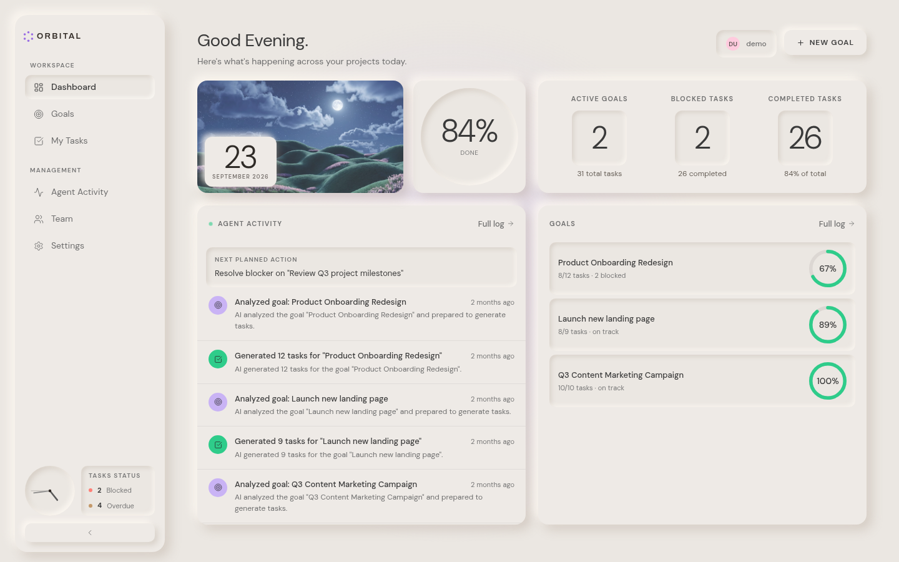 | 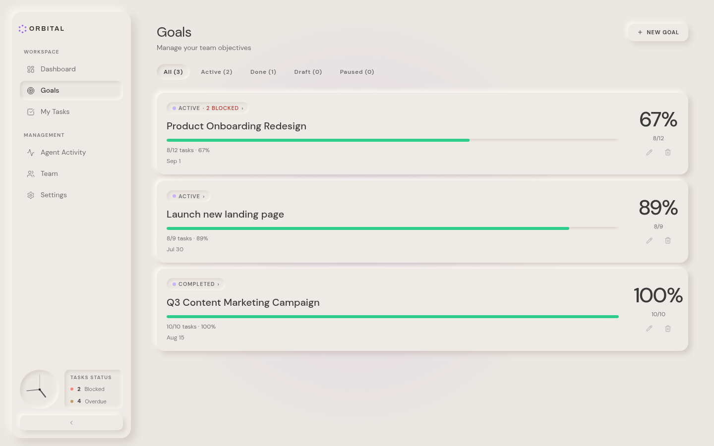 |

| Goal detail (AI-generated plan) | Task check-in |
|:---:|:---:|
| 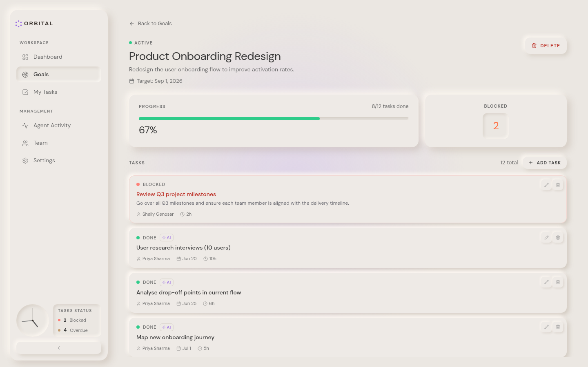 | 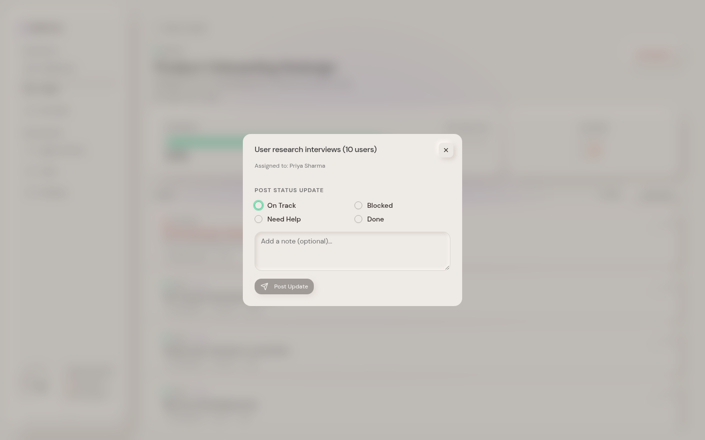 |

| My Tasks | All tasks | Agent activity |
|:---:|:---:|:---:|
| 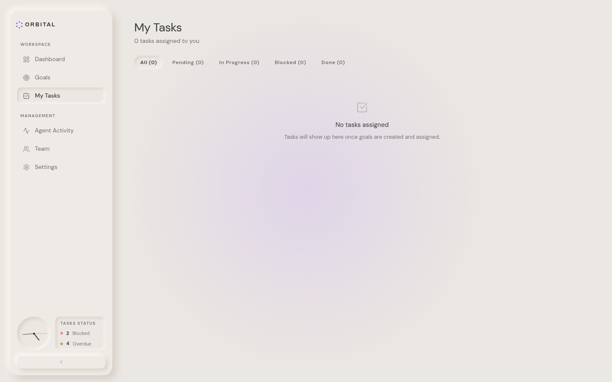 | 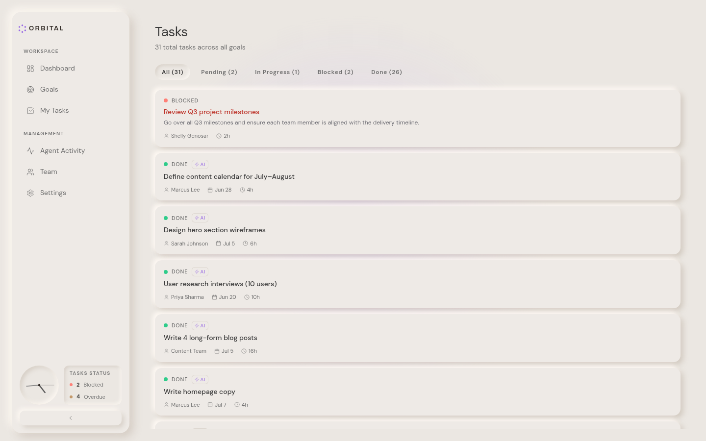 | 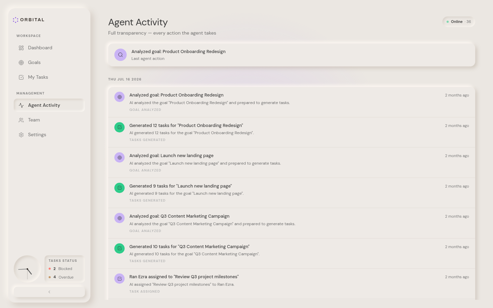 |

| Team | Settings | Login |
|:---:|:---:|:---:|
| 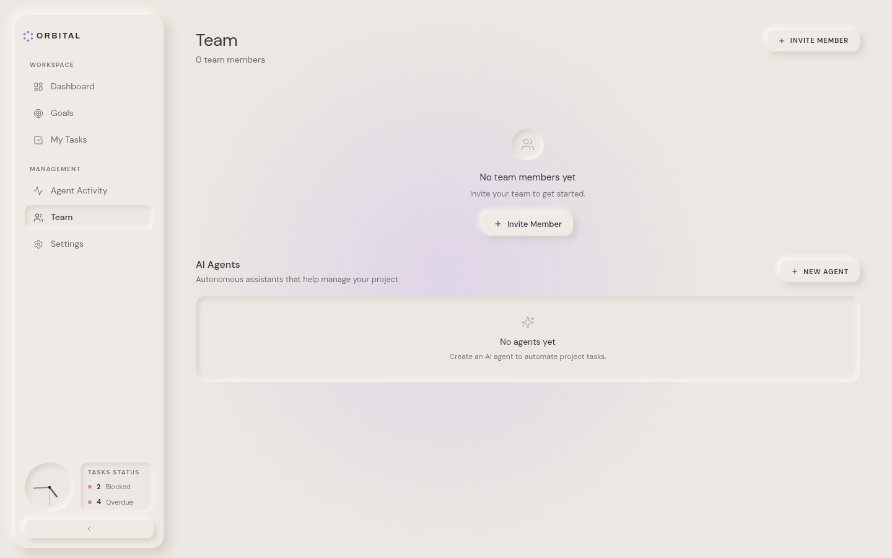 | 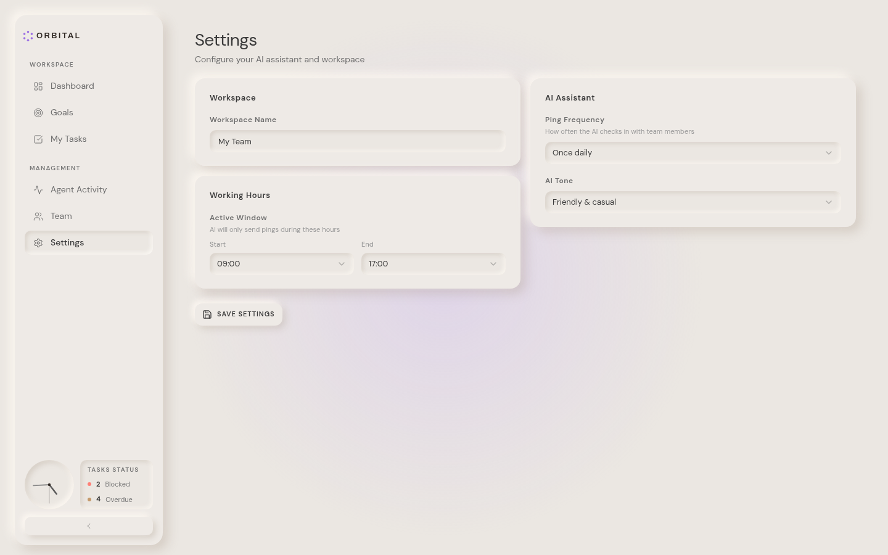 | 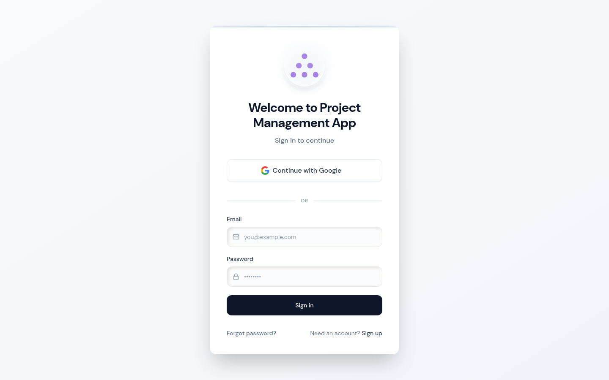 |

<details>
<summary>Mobile</summary>

| Dashboard | Goals | Menu |
|:---:|:---:|:---:|
| 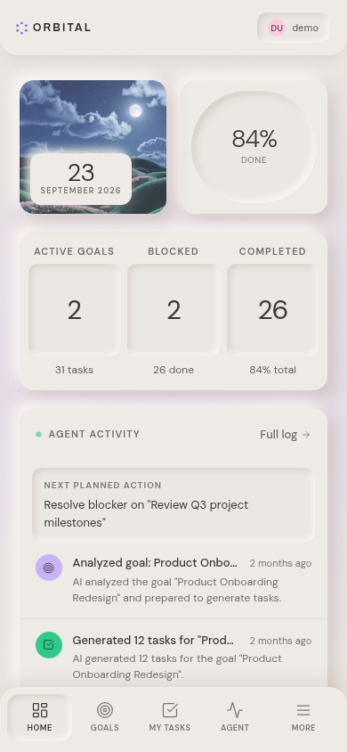 | 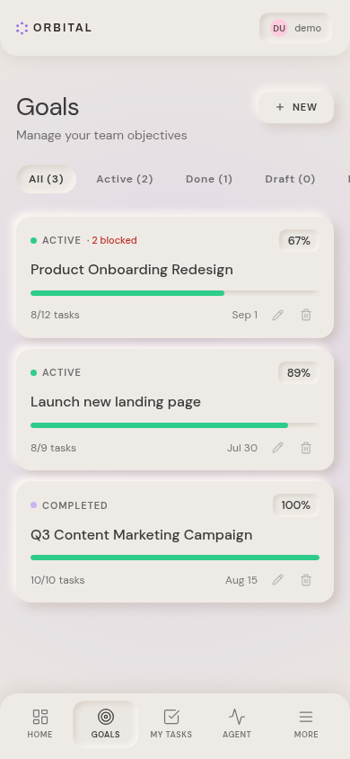 | 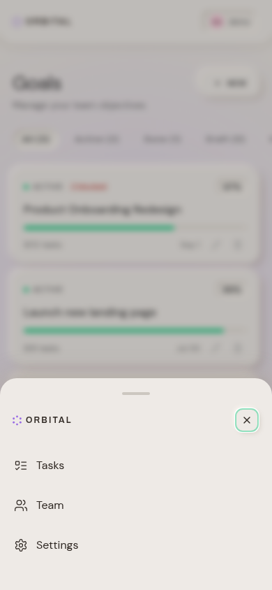 |

</details>

<details>
<summary>Tablet (768–1023) — the middle chrome state</summary>

| Dashboard (greeting header + floating pill nav) |
|:---:|
| 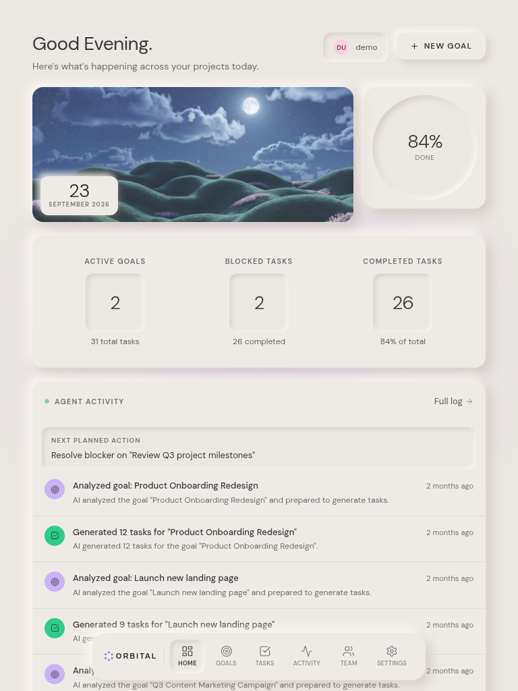 |

</details>

## Tech Stack

| Layer | Technology | Version | Purpose |
|-------|-----------|---------|---------|
| Web framework | Next.js (App Router) | 16.1 | Server page shell + 16 API route handlers |
| UI runtime | React | 19 | Component model |
| Language | TypeScript | 5 (strict) | Type safety end-to-end |
| Styling | Tailwind CSS | 4 | Utility styling + design tokens |
| Components | shadcn/ui on Radix | — | Accessible primitives (dialog, select, radio, …) |
| State | Zustand | 5 | Single client store; server state via fetch + refresh |
| Unit tests | Vitest | 5 | Pure domain seams: router, clarify questions, plan sanitizer, check-in mapping, rate limiter, team forms, next-action, logo geometry, calendar grid, date-fns distance time, greeting boundaries, day-image rotation, db-path resolution |
| E2E tests | Playwright | 1.63 | Browser suite (91 checks): auth, path routes (incl. `/tasks`), goals CRUD, activity feed, mobile + tablet navigation, anchor-nav + wizard deep links, logged-out chrome, the v2.8 Tailwind-v4 parity pins (button cursor, clean chrome shadows, literal chip radius), the v2.9 pins (computed stroke censuses, the login redesign, the native dialog selects, the app-bar/pill-nav/user-menu specs) |
| ORM | Prisma | 6 | Schema, client, `db push`, seed |
| Database | SQLite | — | Zero-config local persistence (`db/custom.db`) |
| Auth | Node `crypto` (scrypt + HMAC) | — | Cookie sessions, no external auth service |
| AI | z-ai-web-dev-sdk | 0.0.x | Server-side task-plan generation |
| Icons | lucide-react | 0.5.x | Icon set |
| Runtime | Bun (or Node ≥ 20) | — | Dev server, scripts, TS execution |

## Architecture

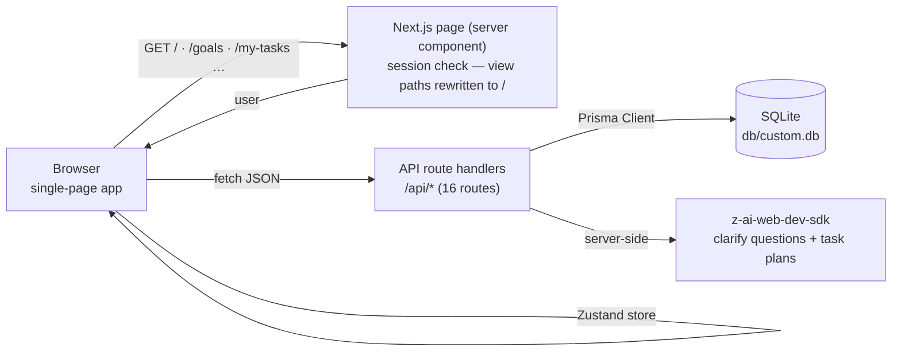

The page at `/` resolves the session and hands a **nullable user** to the client app — the workspace shell renders either way (reference behavior); when unauthenticated it shows empty states and a LOG IN header button, and the store skips data fetches until a session exists. `/login` is a real Next.js route (excluded from the SPA rewrites) that redirects authenticated visitors back to `/`. All data flows through the Zustand store, which calls the API routes and unwraps the `{ ok, data } | { ok, error }` envelope. Views live at **real paths** (`/goals`, `/goals/<id>`, `/my-tasks`, `/tasks`, `/activity`, `/team`, `/settings`) — Next.js rewrites map them onto the single page, and the store syncs view state with the History API (`src/lib/router.ts`), so every screen is deep-linkable and browser back/forward works. Same SPA architecture as the reference app.

**v2.7 — anchor navigation (measured on the re-deployed reference):** every view-switch surface renders a real `<a href>` link — the sidebar nav ×6 + brand + TASKS STATUS widget, the mobile tab bar ×4 (MORE stays a button), the 768 pill nav ×6, the MORE sheet rows (`Tasks → /tasks` — the NEW all-tasks view), the dashboard stat wells / goal wells / "Full log" ×2, and the New Goal pill (`/goals?new=true`, which auto-opens the wizard — the deep link works on hard loads too). Plain left clicks still do in-app pushState navigation; modified/middle clicks fall through so the truthful href opens a real tab. The all-tasks view at `/tasks` shows every workspace task (31 with the seed) with the My-Tasks filter chips and inert `cursor-pointer` rows — the reference's own WIP seam, faithfully replicated (its ring and task rows don't respond to clicks either; our ring mirrors that dead state).

**v2.8 — the Tailwind-v4 affordance + artifact pass (measured on the reference):** the reference's global stylesheet ships `button, [role="button"] { cursor: pointer }` — the clone now mirrors that rule in its base layer (Tailwind v4's preflight sets no pointer, so migrated apps silently lose the hand cursor on every button). The v4 `shadow-[…]` composition artifact (four zero-alpha prefixes from the unset `--tw-*` ring/inset vars) is gone from the chrome: the app bar, mobile tab bar, MORE sheet, 768 pill nav, and the sheet's close square use plain-declaration custom classes that byte-match the reference's computed strings (the close square also moves to the re-measured 3px/6px `0.78/0.27` pair — the v2.0 4px/8px/0.28 reading retired). The `rounded-full` → `calc(infinity*1px)` serialization (33554432px in Chrome) is avoided on the filter chips, which now pin the reference's literal `9999px`. The goal-card anchors wrap the ENTIRE card (1072px, the reference's coverage) with a button-origin click guard — clicks on the action squares open their dialogs without navigating (this also fixes the mobile edit/delete regression where the v2.7 anchor swallowed the click), and the goal wells / dashboard rows nest as bare anchors wrapping inner well divs like the reference. The brand strings render the literal `ORBITAL` everywhere (sidebar, MORE sheet, pill nav) with the reference's redundant `text-transform: uppercase` mirrored.

**v2.9 — the stroke-system + login-redesign pass (measured on the reference):** the reference's icons render at a COMPUTED 1.5px stroke — every lucide svg carries an inline `stroke-width: 1.5` style that overrides the `stroke-width="2"` presentation attribute (CSS beats presentation attributes; the v2.6 "universal 2" census read the attribute and missed the override). The clone now mirrors the measured split: chrome/content glyphs at 1.5 (sidebar, tab bar, pill nav, feed rows, task meta, the AI zap, empty states, the wizard's deadline calendar), the action-button + form-control set at the lucide default 2 (NEW GOAL plus, card action squares, DELETE, Team plus buttons, Settings chevron-downs + save, dialog close Xs, the check-in Send, the picker chevrons, login mail/lock, the popover LogOut), and two specials — the 768 back-strip chevron at 1.8 and the wizard's bot avatar at 1.6. The login page mirrors the reference's redesign: a slate gradient page, a card with a 4px top gradient bar + backdrop blur + overflow hidden, responsive padding (32/40/48), a centered heading column, a blurred gradient halo behind the 80/96px logo chip, a 20px Google glyph, 16px input glyphs, and a sm:flex-row footer. The mobile app bar gains its rounded bottom corners (0 0 20 20) + content-driven height + the literal ORBITAL brand; the 768 pill nav gains the brand's 1px divider and chip-wrapped tabs (min-width 52, the active well on the chip); the goal-edit dialog drops its close square and icon circle (the reference's panel carries neither) and all dialog selects (add-task/task-edit status + assignee, goal-edit status) are NATIVE `<select>` elements like the reference's (216×35, `#EBE7E2`, r10, 13px — `.orb-select`); the user pill/popover move to radius 12 with a 12px `#6E6E6E` name and a 14px LogOut glyph; the MORE sheet computes z-201 and the pill nav z-100; and the remaining `shadow-[inset…]` utilities compose no more zero-alpha prefixes (`.orb-inset`).

## File Hierarchy

```
📂 prisma/
  📄 schema.prisma          # 8 models: User, Person, TeamMember, Goal, Task, TaskUpdate, ActivityLog, WorkspaceSetting
  📄 seed.ts                # Idempotent demo workspace seed
📂 public/
  📄 orbital-logo.svg       # Brand mark
  📄 day-hills-morning.jpg # Dashboard date-card backdrop — rotates by hour
  📄 day-hills-noon.jpg    # (11:00–16:59) with the reference's artwork
  📄 day-hills-dusk.jpg    # (17:00–20:59)
  📄 day-hills-night.jpg   # (21:00–04:59)
  📄 dusk-hills.jpg         # Legacy landscape (unused, kept as an OSS asset)
📂 scripts/
  📄 smoke-test.sh          # 30-check E2E suite + unit tests via `bun run test` (boots prod server)
📂 src/
  📂 app/
    📄 page.tsx             # Workspace route: session → OrbitalApp (nullable user)
    📄 layout.tsx           # DM Sans / DM Mono fonts, global styles
    📄 globals.css          # Tailwind 4 tokens + neumorphic primitive classes
    📂 login/               # Real /login route — auth card (3 states, from_url)
    📂 api/                 # 16 route handlers (auth, goals, tasks, team, activity, stats, settings, health)
  📂 components/
    📂 orbital/             # The application
      📄 orbital-app.tsx    # App shell (nullable user): sidebar + views + mobile tab bar
      📄 login-screen.tsx   # LoginCard — the /login auth card (3 states)
      📄 store.ts           # Zustand store: all server state + actions
      📄 sidebar.tsx        # Desktop navigation (collapsible; clock + tasks status)
      📄 sidebar-clock.tsx  # Neumorphic analog clock (SVG, 15s tick)
      📄 sidebar-collapse.ts# Collapse state: useSyncExternalStore + localStorage
      📄 user-menu.tsx      # UserMenuOrLogin: avatar popover w/ Log Out, or LOG IN button
      📂 views/             # dashboard, goals, goal-detail, my-tasks, tasks (all-tasks, v2.7), activity, team, settings
      📂 dialogs/           # new-goal (3-step wizard + date picker), goal-edit, add-task, task-edit, task-detail, invite-member
    📂 ui/                  # shadcn/ui primitives + date-picker
  📂 lib/
    📄 orbital.ts           # Domain types, DTOs, status metadata (labels + colors)
    📄 router.ts            # View ↔ path mapping (parseUrl / toPath) — unit tested
    📄 clarify.ts           # Wizard clarifying questions: LLM sanitizer + fallback — unit tested
    📄 plan-sanitizer.ts    # AI task-plan bounds + template fallback — unit tested
    📄 checkin.ts           # Check-in → task-status mapping — unit tested
    📄 rate-limit.ts        # Fixed-window per-IP auth throttling — unit tested
    📄 team.ts              # Invite/agent form normalization — unit tested
    📄 calendar.ts          # Month-grid math for the date picker — unit tested
    📄 api.ts               # ok()/fail() envelope helpers + session guard
    📄 auth.ts              # scrypt hashing, HMAC session tokens, cookie handling
    📄 db.ts                # Prisma client + SQLite URL normalization
    📄 utils.ts             # cn() class merge
📄 docs/
  📂 screenshots/           # App screenshots used by this README
```

## Quick Start

Requires **Bun** (recommended) or **Node.js ≥ 20** with npm.

```bash
# 1. Install dependencies
bun install                # or: npm install

# 2. Configure environment
cp .env.example .env       # defaults are correct for local use

# 3. Create + seed the database
bun run db:push            # or: npx prisma db push
bun run db:seed            # or: npx tsx prisma/seed.ts

# 4. Start the dev server
bun run dev                # or: npm run dev
```

Open <http://localhost:3000> and sign in with the seeded demo account:

| Email | Password |
|-------|----------|
| `demo@orbital.app` | `Demo1234!` |

### Verify Setup

```bash
curl http://localhost:3000/api/health
# {"status":"ok","app":"orbital","ts":"…"}

# Full end-to-end verification (30 checks: auth, CRUD, validation, routing, rate limit, logout)
./scripts/smoke-test.sh    # builds must exist: run `bun run build` first
```

### Production

```bash
bun run build              # next build + standalone assembly
bun run start              # serves .next/standalone/server.js on :3000
```

## Environment Variables

| Variable | Required | Description | Default |
|----------|----------|-------------|---------|
| `DATABASE_URL` | Yes | SQLite connection string. Relative `file:` paths resolve against `prisma/` (the CLI rule) — `src/lib/db-path.ts` implements the same rule for the runtime and also repairs the standalone server's `chdir` into `.next/standalone`, so `file:../db/custom.db` points at `<repo>/db/custom.db` in every context. | `file:../db/custom.db` |
| `AUTH_SECRET` | Production | HMAC secret for session cookies. Generate with `openssl rand -hex 32`. Falls back to an insecure dev constant when unset. | — |
| `NEXT_PUBLIC_SITE_URL` | Recommended | Canonical public origin — used for metadata URLs and `sitemap.xml`. | `http://localhost:3000` |

## API Reference

All endpoints return `{ "ok": true, "data": … }` or `{ "ok": false, "error": { "code", "message" } }`. 🔒 = requires session cookie.

| Endpoint | Method | Description |
|----------|--------|-------------|
| `/api/health` | GET | Liveness probe |
| `/api/auth/register` | POST | Create account (name, email, password) — rate-limited |
| `/api/auth/login` | POST | Sign in, sets session cookie — rate-limited (10 attempts/IP/15 min, then `429 RATE_LIMITED`) |
| `/api/auth/logout` | POST | Clear session |
| `/api/auth/me` | GET | Current user |
| `/api/stats` 🔒 | GET | Dashboard stats (totals, completion rate) |
| `/api/goals` 🔒 | GET / POST | List / create goals |
| `/api/goals/clarify` 🔒 | POST | Wizard step: AI clarifying questions for a goal draft (3 questions, deterministic fallback) |
| `/api/goals/[id]` 🔒 | GET / PATCH / DELETE | Goal detail (with tasks) / update / delete |
| `/api/goals/[id]/generate-tasks` 🔒 | POST | AI-generate a task plan for an empty goal (409 if already planned; accepts optional clarifying `answers`) |
| `/api/tasks` 🔒 | GET / POST | List (filters: `assignee=me\|<personId>`, `status`, `goal`) / create |
| `/api/tasks/[id]` 🔒 | GET / PATCH / ⚠️ DELETE | Task detail / update / delete |
| `/api/tasks/[id]/updates` 🔒 | POST | Post a status check-in (flips task status, logs activity) |
| `/api/team` 🔒 | GET / POST | People + members / invite member (email + role) or create AI agent (name + description + instructions) |
| `/api/activity` 🔒 | GET | Activity feed (latest 50) |
| `/api/settings` 🔒 | GET / PATCH | Workspace settings (name, working hours, ping frequency, AI tone) |

## Design System

Measured from the reference app (v1.7) — a soft-beige neumorphic system with **three card tiers**: raised surfaces carry dual embossed shadows (light `rgba(255,250,244,…)` top-left, dark `rgba(160,143,126,…)` bottom-right) at standard depth for buttons, deeper alpha for row cards (goals/tasks/activity), and a large `-8px` pair for view panels (dashboard, settings, stats); inset wells carry the same pair inverted. Main content sits in a 1200px clamped column over a canvas washed with a soft purple radial glow centered in the viewport; in-dialog submits are charcoal pills (`#3A3A3A` bg, `#F1F1F0` text) — 12px/600 normal-case in the standard 500px/radius-20 form dialogs (pad 28/28/24, 15px/600 headings, 36px inputs), 11px/600 uppercase in the wizard; the desktop sidebar is sticky (top 0, height viewport−40px) with a compact brand, plain TASKS STATUS block and two-tier uppercase label typography (11px/600 panel labels, 10px/600 small labels); mobile is full-bleed with an app bar and a full-width bottom-attached tab bar.

| Token | Hex / Value | Usage |
|-------|-------------|-------|
| `--orb-canvas` | `#EBE7E2` | Page canvas (24px padding, no outer panel) |
| `--orb-raised` | `#EEEAE6` | Raised surfaces: sidebar, cards, dialogs, buttons |
| `--orb-well` | `#EBE7E2` | Inset wells: inputs, chips, clock face, icon squares |
| `--orb-track` | `#DDD8D2` | Progress track behind the green fill |
| `--orb-body` | `#2F2823` | Primary text |
| `--orb-heading` | `#3A3A3A` | Headings / button text |
| `--orb-muted` | `#6E6E6E` | Secondary text |
| `--orb-green` | `#2ECC8A` | Success / done / active |
| `--orb-purple` | `#996CE4` | In-progress / AI accents |
| `--orb-coral` | `#FF8077` | Blocked / destructive (deep `#BD3228`; blocked cards add a coral inset ring `rgba(255,128,119,0.18)`) |

Primitive classes in `globals.css`: `.orb-raised` / `.orb-raised-lg` (panels), `.orb-panel` (large-tier view panels), `.orb-row-card` / `.orb-goal-card` (deeper-tier row cards), `.orb-raised-btn` (buttons), `.orb-well` / `.orb-well-pill` (insets), `.orb-task-blocked` (blocked-card ring), `.orb-btn-dark` / `.orb-btn-post` (dark wizard/check-in submits), `.orb-btn-submit` / `.orb-btn-cancel-std` (the v2.0 standard-dialog 12px normal-case pair), `.orb-btn-cancel` (dialog secondary), `.orb-pill-round` (team action buttons), `.orb-nav-active` (the mobile tab bar + sidebar active chip's bright inset pair), the label tiers `.orb-label` / `.orb-label-sm`, plus the `.orb-pill` family for page-level actions. Typography: **DM Sans** (UI) and **DM Mono** (numeric/date accents), loaded via `next/font`. Status dots and text pair each palette color with a deeper accessible variant (`--orb-*-deep`).

## Testing

```bash
bun run test              # unit tests — 138 checks on the pure domain seams
bun run test:e2e           # Playwright — 73 browser checks (needs `bun run build` first)
./scripts/smoke-test.sh    # curl E2E — 30 checks against the production build
```

The unit layer (Vitest) pins the pure logic: path routing (`src/lib/router.ts`), the wizard's clarifying questions (`src/lib/clarify.ts`), the AI plan sanitizer + fallback (`src/lib/plan-sanitizer.ts`), the check-in status mapping (`src/lib/checkin.ts`), the auth rate limiter (`src/lib/rate-limit.ts`), the team-form normalization (`src/lib/team.ts`), the dashboard's next-planned-action derivation (`src/lib/next-action.ts`), the logo dot geometry (`logo.tsx`), the date-picker calendar grid + long date format (`src/lib/calendar.ts`), the activity feed's date grouping (`src/lib/activity-groups.ts`), the activity type-tag mapping (`src/lib/activity-tags.ts`), the dashboard greeting boundaries (`greetingFor`), the date-fns long-form distance (`formatDistance`/`relativeTime`), the date-card photo rotation (`src/lib/day-image.ts`), and the SQLite URL resolution incl. the standalone-server `chdir` trap (`src/lib/db-path.ts`) — **138 checks**.

The Playwright layer (`tests/e2e/`) drives the real UI in Chromium against the production build: the login round-trip, the SPA path routes + browser back/forward, the goals surface (seed order, blocked-count typography, add-task dialog, inline delete), and — the highest-regression-risk chrome — the MOBILE navigation (bottom tab bar with the active tab's inset-well chip, the MORE bottom sheet, the 768 middle-state pill nav). A setup project signs the demo user in once and shares the session cookie via storageState (the auth rate limiter makes per-test logins a trap). The suite boots the standalone server on port 3100 with its own scratch database (`db/e2e.db`), so it never touches your dev data — **73 checks** (v2.4 added the full-tab chip width, the wider MORE tab, and the mobile goal-card chip inversion; v2.5 added the hero-in-group feed semantics, the dashboard's 20-row activity cap + task-based Next Planned Action, the regenerated seed plans, and the logged-out LOG IN button's measured spec; v2.6 rewrote the stroke assertions to the reverted single-class stroke 2 and pinned the activity group card, the dashboard row wrap, the desktop goal-chip case, the date-picker headers, and the check-in modal spacing; v2.7 added the anchor-navigation census across every surface, the `/tasks` all-tasks view, the `/goals?new=true` wizard deep link, and the dead-ring/mobile-brand pins; v2.8 pinned the Tailwind-v4 affordance/artifact pass — every button computes `cursor: pointer` like the reference's global rule, the chrome shadows (app bar / tab bar / MORE sheet / pill nav / sheet close) render clean single declarations instead of v4's composed zero-alpha strings, the filter chips compute a literal `9999px` radius, the goal-card anchors span the whole card with button-origin clicks guarded, and the brand strings are the literal `ORBITAL`).

The smoke suite boots the production standalone server, then runs **30 checks**: health, login (valid + wrong password + unauthenticated rejection), all six read endpoints, task creation, invalid-status rejection (400), status check-in round-trip (task status flips + update recorded), deletion, logout invalidation, page render, **path-route serving** (`/goals`, `/goals/<id>`, `/my-tasks`, `/activity`, `/team`, `/settings` — plus a 404 guard on unknown paths), the **clarify endpoint** (3 questions + validation), **team validation** (invite with invalid email, agent without a name), and the **login rate limit** (rapid-fire attempts earn `429 RATE_LIMITED`). It exits non-zero on any failure and cleans up after itself.

## Troubleshooting

| Symptom | Cause | Fix |
|---------|-------|-----|
| `Error code 14: Unable to open the database file` | Server started from a directory with no `prisma/schema.prisma` and no absolute `DATABASE_URL` | Start via `bun run start`, or set an absolute `file:` URL (see `docs/DEPLOYMENT.md` §4) |
| `Is port 3000 in use?` | Stale dev/prod server | `pkill -f "next dev"` or `pkill -f "standalone/server.js"` |
| Login loops back to the sign-in page | `AUTH_SECRET` changed between server restarts | Keep `AUTH_SECRET` stable in production |
| "Continue with Google" shows a toast instead of signing in | Expected — the self-hosted clone carries no OAuth credentials (documented deviation) | Configure an OAuth provider + adapt `login-screen.tsx` if you need real Google sign-in |
| Login suddenly returns 429 | Per-IP rate limit engaged (10 attempts / 15 min) | Wait for the window to reset (see `Retry-After`) or restart the server to clear in-memory buckets |
| Prisma `P1003` / missing tables | Database not initialized | `bun run db:push && bun run db:seed` |
| AI generation returns a generic 8-step plan | SDK unavailable/malformed output — deterministic fallback engaged | Expected behavior; configure the SDK environment to get LLM plans |

## License

No license file is present in this repository; all rights are reserved by default. Add an explicit license before redistributing.
